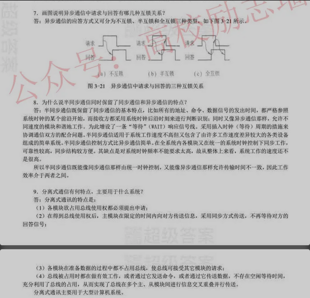
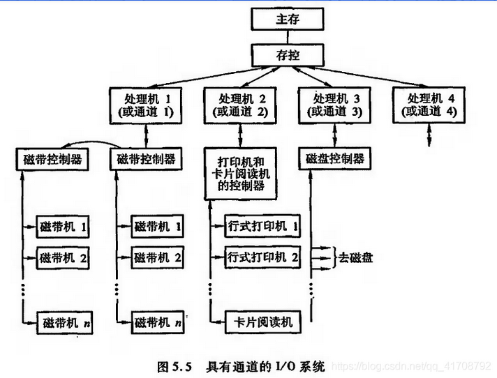
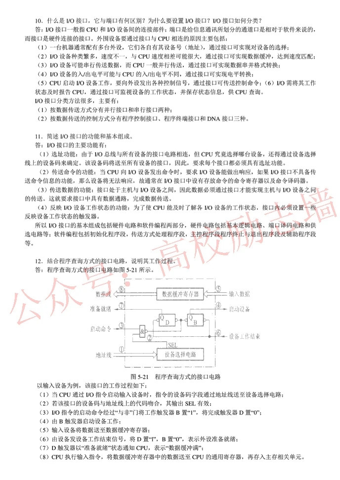
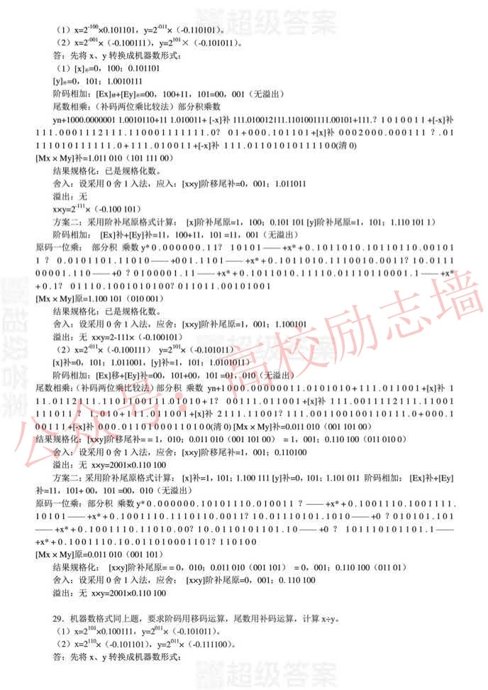
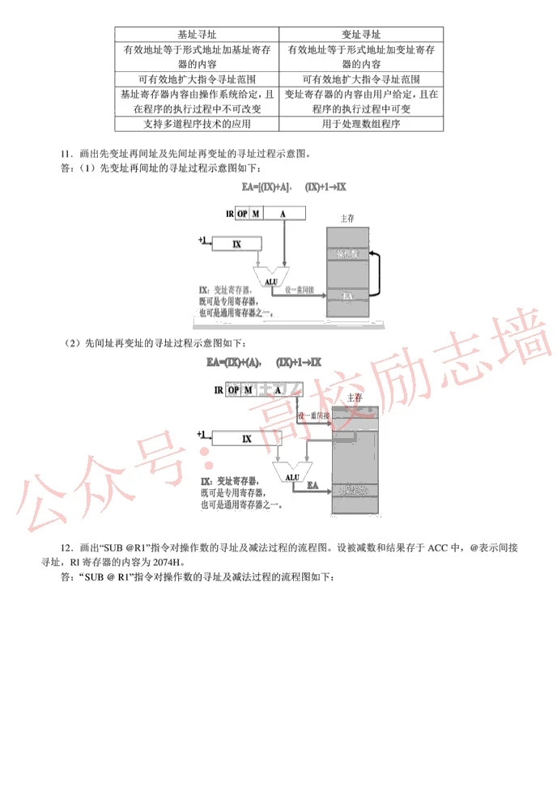

# 计算机组成原理(完结)：

作者：唐朔飞

- [x] 1、2章，介绍了计算机的基本组成以及计算机的发展应用和展望

- [x] 3、4、5 章：详细介绍了除CPU外的存储器、I/O系统以及连接CPU、存储器、I/O之间的通信总线

- [x] 6、7、8章：详细介绍CPU除控制单元的特性、结构和功能，包括计算机的基本运算、指令系统、中断系统等

- [x] 9、10 章，专门介控制单元的功能，以及采用组合逻辑和微程序方法设计控制单元的设计思路和实现措施

# ^第 一 篇：概论

## 第1章 计算机系统概论

- [x] 主要介绍**计算机系统的基本组成，应用和发展**，并通过对本书结构的介绍，指出学习本书的基本思路

### 1.1计算机系统介绍

- [ ] 计算机系统 由 **硬件**和 **软件** 两部分组成

​	硬件：计算机的实体部分

​	软件：具有各类功能的程序组成，通常将程序寄寓于各类媒体（ROM、RAM、磁带，磁盘），通常存放在主存	和外存

- [ ] 计算机软件 分 **系统软件**和  **应用软件**

高级语言---汇编语言--机器语言

高级语言程序翻译成机器语言程序的软件称为翻译软件：**编译程序** 或 **解释程序**

​	编译程序：将用户编写的高级语言程序（源程序）的全部语句一次全部翻译成机器语言程序

​	解释程序：将源程序的一条语句翻译成对应于机器语言的一条语句，并且执行这条语句

- [ ] ​	/*														**多级层次结构的计算机系统：**										*/	


- [ ] **区分计算机体系结构和计算机组成：**

计算机体系结构：是指哪些能够被程序员所见到的计算机系统的属性

​	计算机属性：传统机器的属性

计算机组成：指如何实现计算机体系结构所体现的属性，它包含了许多对程序员来说是同名的硬件细节

-----

如：指令系统 体现机器的属性，这是计算机结构问题；但指令的实现，即如何取指令，分析指令，取操作数，运算，送结果。都属于计算机组成的问题。

### 1.2 计算机的基本组成

- [ ] 冯·诺依曼计算机特点：

- 计算机由运算器、控制器、存储器、输入和输出设备五大部件组成
- 指令和数据以同等地位存放在存储器内，并可按地址寻访
- 指令和数据均用二进制表示
- 指令由操作码和地址码组成，操作码表示操作的性质，地址码表示操作数在存储器中的位置
- 指令在存储器内按顺序存放，通常，指令是顺序执行的，在特定条件下，可根据运算结果或设置的条件改变执行顺序
- 机器以运算器为中心，输入输出设备与存储器间的数据传送通过运算器完成

- [ ] 冯·诺依曼计算机结构框图：


- [ ] 以 “存储器” 为中心的计算机


- [ ] 现代计算机将 运算器和控制器集成在一起称“CPU” ,输入输出设备称I/O设备；

  CPU和主存储器合称：主机；I/O设备又称外部设备；

- [x] 细化的计算机组成框图


1. 主存储器：**存储体M，逻辑部件，控制电路**

   *存储体M：若干存储单元组成，存储单元包含若干**存储元件（存储基元，存储元**），存储元能寄存以为二进制代码“0" 或”1“，一个存储单元可存一串二进制代码，称这串二进制代码为一个存储字；

   *主存的工作方式是按存储单元的地址号来实现对存储字各位的存（写入），取（读出）

   *为了实现按地址访问的方式，主存还必须配置寄存器MAR和MDR。

   ​	MAR=Memory Address Register：存储地址寄存器--用来存放欲访问的存储单元的地址，其位数对应存储单元的个数

   ​	MDE=Memory Data Register 存储数据寄存器：用来存放从存储体某单元取出的代码或者准备往某存储单元存入的代码。其位数与存储字长相等；

2. 运算器：**ALU** 、**ACC**、**MQ**

   ALU：算术逻辑单元

   ACC：累加器

   MQ：乘商寄存器

3. 控制器：**取指、分析、执行 三阶段**

   **程序计数器 PC、指令寄存器IR 、控制单元CU**

   PC：存放当前欲执行指令的地址，与主存的MAR之间有一条直接通路，具有自动+1功能，即自动形成下一指令的地址

   IR：存放当前指令，IR的内容来自主存的MDR，并将操作码送至CU，操作数的地址送至MAR 

   CU：分析当前指令所必须操作

4. I/O系统

   I/O系统分I/O设备和相应接口，每一种I/O设备都由I/O接口与主机联系。它接收CU发出的各种控制指令，并完成相应的操作

### 1.3 计算机硬件的主要技术指标

机器字长：指CPU一次能处理数据的位数，通常与CPU寄存器位数有关。

存储容量：主存中存放二进制代码的总位数：存储容量=存储单元个数*存储字长；--MAR反应存储单元个数，MDR反应存储字长

运算速度：FLOPS浮点运算次数衡量


-----

### 思考与习题：

- [ ] 如何理解计算机系统的层次结构:

​	微指令系统、机器语言系统、操作系统、汇编语言、高级语言、应用语言

- [ ] 说明高级语言、汇编语言、机器语言的差别及其联系：

​	高级语言是建立在汇编语言之上，汇编语言建立在机器语言之上，机器语言能被计算机所识别。

- [ ] 冯·诺依曼计算机的特点：

​	计算机由运算器、控制器、输入、输出设备、存储器组成

​	数据和指令均以二进制存储

​	数据和指令地位相同，保存在存储器

​	计算机以运算器为中心，控制计算机的执行

> 计算机由运算器、控制器、存储器、输入和输出设备五大部件组成
>
> 指令和数据以同等地位存放在存储器内，并可按地址寻访
>
> 指令和数据均用二进制表示
>
> 指令由操作码和地址码组成，操作码表示操作的性质，地址码表示操作数在存储器中的位置
>
> 指令在存储器内按顺序存放，通常，指令是顺序执行的，在特定条件下，可根据运算结果或设置的条件改变执行顺序
>
> 机器以运算器为中心，输入输出设备与存储器间的数据传送通过运算器完成

- [ ] 如何理解计算机组成和计算机体系结构

  计算机体系结构：是指计算机的属性

  计算机组成：是指实现计算机体系结构的细节

- [ ] 解释概念：

1. 主机：CPU和存储器的组合称主机
2. CPU：由运算器和控制器集合而成
3. 主存：主存储器
4. 存储单元：由若干存储基元或存储元组成，存储元寄存“0”或“1”,一个存储单元可存一串二进制位
5. 存储元件：又称存储元，寄存“0”或“1”，
6. 存储基元：跟存储元件一个概念
7. 存储元：跟存储元件一个概念
8. 存储字：若干个存储元组成的二进制代码称为存储字
9. 存储字长：存储字的位数
10. 存储容量：主存中存储二进制代码的位数
11. 机器字长：CPU一次能处理的数据位数
12. 指令字长：指令的位数

- [ ] 解释英文代号：

CPU：中央处理器

PC：程序计数器

IR:指令寄存器

CU：控制单元

ALU：算术逻辑单元

ACC：累加器

MQ：乘商寄存器

X：寄存器

MAR：存储地址寄存器

MDR：存储数据寄存器

I/O ：输入输出设备

- [ ] 什么是指令？什么是程序？

指令：具有一定含义的代码

程序：执行某种逻辑算法的代码

- [ ] 指令和数据存放在存储器中，计算机如何区分它们？

放到IR则为指令，放到MDR为数据

### **正确答案：**


## 第2章 计算机的发展和应用

### 2.1 计算机的发展历史

第一代电子管计算机：冯·诺依曼提出程序和数据一起放在存储器中

第二代晶体管计算机：贝尔实验室成功用半导体硅制成晶体管

第三代集成电路计算机：利用光刻技术把各种器件结合在一起

微型计算机的出现：

- ​	集成电路技术将计算机的控制单元和算术逻辑单元集成到一个芯片上，制成了处微理器芯片。

- ​	随着半导体存储器的发展，存储芯片的容量不断提高

- ​	微处理器芯片+存储芯片出现后，微型计算机也随之问世；

微处理器的发展重点:

- 进一步提高复杂度来提高处理器性能
- 通过线程/进程级并行性的开发提高处理器的性能
- 将存储器集成到处理器芯片内来提高处理器性能
- 发展嵌入式处理器


### 2.2 计算机的应用

1. 科学计算
2. 工业控制和实时控制
3. 网络技术的应用
4. 虚拟现实
5. 办公自动化和管理信息系统
6. CAD/CAM/CIMS 
7. 多媒体技术
8. 人工智能

### 2.3 计算机的展望

带给人们绚丽多彩的生活


-------

### 思考与习题及答案：


# ^第 二 篇算机系统的硬件结构

计算机硬件系统由中央处理器、存储器、I/O系统以及连接它们的系统总线组成。

本篇介绍**系统总线、存储器、和I/O系统**三部分，中央处理器将在第3篇单独讲述。

## 第3章 系统总线

### 3.1  总线的基本概念

计算机系统的五大部件之间的互联方式有两种：一种是各部件之间使用单独的连线，称为**分散连接**；另一种是将各部件连到一组公共信息传输线上，称为**总线连接**；

**采用总线的计算机结构：**


- CPU和主存的总线：存储总线（M总线）
- CPU和各I/O设备之间交换信息的通道，称为输入输出总线（I/O总线）
- 各种I/O设备通过I/O接口挂到I/O总线上，便于增删设备

**采用单总线的计算机结构：**


- 需要对各部件设置优先级，防止总线冲突

**以存储器为中心的双总线结构：**


- 在单总线的基础上开辟出一条CPU和主存之间的总线，为存储总线。只供主存和CPU之间传输信息，提高了效率
- 保留了I/O设备与存储器交换信息时不经过CPU的特点。

### 3.2 总线的分类

**片内总线：芯片内部的总线，如CPU芯片内部，寄存器和寄存器之间，寄存器与算术逻辑单元ALU之间都由片内总线连接。**

**系统总线：指各大部件之间的信息传输线。因为部件通常安放在主板或各个插件板上，又称板级总线；**

​	系统总线按传输用途又分：数据总线，地址总线，控制总线			

- 数据总线：传输各部件之间的数据信息，它是双向传输总线，其位数与存储字长有关。数据总先的位数称为数据总线宽度。
- 地址总线：指出数据总线上的源数据或目的数据在主存单元的地址或I/O设备的地址，由CPU单向输出。
- 控制总线：由于数据、地址总线总是被所有部件所共享，如何使各部件能在不同时刻占有总线使用权，需要依靠控制总线来完成。因此控制总线是用来发出各种控制信号的传输线。对控制总线整体来说，传输是双向；

**通信总线：用于计算机之间或计算机与其他系统之间的通信**

​	按传输方式分：**串行通信**，**并行通信**

- 串行通信：单位1位宽的传输线，适宜远距离通信
- 并行通信：多条1位宽的传输线，适宜短距离通信

### 3.3 总线特性及性能指标

总线结构的物理实现：将 **导线**直接印制在电路板上，延伸到各个部件；

------

**总线特性：**

> 机械特性：规定机械连接的一些标准，如引脚个数，排列顺序
>
> 电气特性：规定信号的传递方向和有效的电平范围
>
> 功能特性：总线中每根传输线的功能：地址总线用来传输地址码，数据总线用来传输数据
>
> 时间特性：总线中的任一根线在什么时间内有效

**总线性能指标：**

- [x] 总线宽度：通常是指数据总线的根数，用bit ( 位 ）表示；

- [x] 总线带宽：可以理解为总线的传输速率，即单位时间总线上传输数据的位数，通常用**每秒传输信息的字节数**衡量；**如：总线工作频率33MHz,总线宽度32位,则总线宽度为33*（32/8)=132MBps**
- [ ] 时钟同步/异步：总线上的数据与时钟同步工作的总线称为同步总线，与时钟不同步的总线称为异步总线
- [x] 总线复用：将地址总线和数据总线合并，通过分时进行传输
- [ ] 信号线数：地址总线，数据总线，控制总线三种总线数的总和；

**总线标准：**

采用总线标准可以为计算机接口的软硬件设计提供方便。对硬件设计而言，使各个模块的接口芯片设计相对独立；对软件设计而言，更有利于接口软件的模块化设计；

目前的总线标准：

1. ISA总线：IBM为16位CPU设计的，具有独立的总线时钟
2. EISA总线：ISA的升级，将总线控制权从CPU中分离，而具有智能化的总线
3. VESA（VL-BUS)总线：局部总线标准，是指在系统外为两个以上模块提供高速传输信息通道，该标准从CPU总线演化而来；
4. PCI总线：是ISA\EISA的升级，是一种不依附某个具体处理器的局部总线
5. AGP总线：突破了PCI对三维数据处理的缺点，是显示卡专用的局部总线
6. RS-232C总线：串行通信总线标准；DTC（数据终端设备）--串并转换--- DCE（数据通信设备） ---   通信线路   ----DCE--串并转换--DTC
7. USB总线：计算机串行接口总线标准

### **3.4总线结构：**

**单总线结构、多总线结构**

单总线结构:参考**采用单总线的计算机结构图**

- [x] **双总线结构**


- [x] **三总线结构（两种）：**


- [x] **四总线结构：**


### **3.5总线控制**

规定接受信息的部件等一系列问题都需要由总线控制器统一管理，它主要包括**判优控制（或称仲裁逻辑）和通信控制**

诠释：**判优控制=哪个设备先占用总线，通信控制=设备占用时间**；

众多部件共享总线，在争夺总线使用权是，应按各部件的优先等级来解决。在通信时间上，则应按分时方式来处理，即以获得总线使用权的先后顺序分时占用总线，即哪一个部件获得使用权，此刻就由它传送；

-----

总线判优控制

1. 总线上所连接的各类设备，按其对总线有无控制功能可分**主设备**（模块）和**从设备**（模块）两种；
2. **主设备**对总线有控制权；**从设备**只能响应从主设备发来的总线命令，对总线没有控制权。
3. 若多个主设备同时要使用总线，就由**总线控制器的判优、仲裁逻辑**按一定的优先等级顺序确定哪个主设备能使用总线。只有获得总线使用权的主设备才能开始传送数据；

总线判优控制分**集中式**和**分布式**两种，

- [x] ​	前者将控制逻辑集中在一处（如CPU中），

- [x] ​	后者将控制逻辑分散在与总线连接的各个部件或设备上；

集中式判优控制 有三种：

1. 链式查询

   

   - 可见，链式查询中，**离总线控制部件最近的设备具有最高的优先级**。特点是：只需很少几根线就能按一定次序实现总线控制，并且很容易扩充设备，但对电路故障很敏感，且优先级别低的设备很难获得请求

2. 计数器定时查询

   

   - 相对于链式查询，少了BG(总线同意)、多了设备地址线；计数可以从“0”开始升序，对电路故障没有链式那么敏感，控制却复杂

3. 独立请求方式

   

   - 总线中有一排队电路，可根据优先次序确定响应哪一台设备的请求
   - 特点：响应速度快，优先次序控制灵活，但控制线数量多，复杂

4. 三种方式比较

   链式查询仅用2根线，计数器定时查询用log2(n)根，独立请求式则用2n根

总线通信控制

通常将完成一次总线操作的时间称为总线周期，可分为以下4个阶段。

1. **申请分配阶段：由需要使用总线的主模块（主设备）提出申请，经总线仲裁机构决定下一传输抽取的总线使用权授予某一申请者**
2. **寻址阶段：取得了使用权的主模块通过总线发出本次要访问的从模块（从设备）的地址及有关命令，启动参与本次传输的从模块**
3. **传数阶段：主模块和从模块进行数据交换，数据由源模块发出，经数据总线流入目的模块**
4. **结束阶段：主模块的有关信息均从系统总线上撤除，让出总线控制权**

总线通信控制主要解决通信双方如何获知传输开始和传输结束，以及通信双方如何协调如何配合。通常用四种方式：**同步通信，异步通信，半同步通信和分离式通信**

- [x] **同步通信**

**通信双方由统一时标控制数据传送称为同步通信，时标通常由CPU的总线控制部件发出；**

**同步通信之读**


- 同步通信一般用于总线长度较短，各部件存取时间比较一致的场合

> **例：假设总线的时钟频率为100Mhz,总线的传输周期为4个时钟周期，总线的宽度为32bit,试求总线的数据传输率。若想提高一倍数据传输率，可采取什么措施？**
>
> **解：100Mhz=1/100=0.01us（微秒）**
>
> ​       **则总线时钟周期=4*0.01=0.04us**
>
> ​      **数据传输率=4B/0.04us=100MBps** 
>
> **若想提高一倍数据传输率则总线宽度提高至64位，或时钟频率提高至200Mhz** 

- [x] **异步通信**

**异步通信克服了同步通信的缺点，允许各模块速度的不一致性；异步通信采用应答方式（又称握手方式），即当主模块发出“请求”信号时，一直等待从模块反馈回来“响应”信号后，才开始通信；**

异步通信的应答方式又分为 **不互锁**、**半互锁**、**全互锁** 三种类型

1. 不互锁：

   

   - 主模块发出请求信号后，不必等待接到从模块的回答信号，而是进过一段时间，确认从模块已收到请求信号后，便撤销其请求信号；从模块接到请求信号后，在条件允许时发出回答信号，并且经过一段时间(这段时间的设置对不同设备而言是不同的)确认主模块已经收到回答信号后，自动撤销回答信号。可见通信双方并无互锁关系。

2. 半互锁：

   

   - 主模块发出请求信号，必须待接到从模块的回答信号后再撤销其请求信号，有互锁关系；而从模块在接到请求信号后发出回答信号，但不必等待获知主模块的请求已经撤销，而是隔一段时间后自动撤销其回答信号，无互锁关系。由于一方存在互锁关系，一方不存在互锁关系，故称半互锁方式。

3. 全互锁：

   

   - 主模块发出请求信号，必须待从模块回答后再撤销其请求信号；从模块发出回答信号，必须待获知主模块请求信号已经撤销后，再撤销其回答信号。双方存在互锁关系，故称全互锁方式

异步通信可用于并行传送或串行传送。

- [x] 异步串行通信式，没有同步时钟。异步串行通信字符格式：**1个起始位（低电平），5~8个数据位，1个奇偶校验位（作检错用）、1或1.5或2个终止位（高电平）。传送时起始位后面紧跟的是要传送字符的最低位，每个字符的结束是一个高电平的终止位。起始位至终止位构成一帧，两帧之间的间隔可以是任意长度；**

- [x] 异步串行通信的数据传送速率用**波特率**来衡量，**波特率是指单位时间内传送二进制数据的位数，单位bps，记作波特；**

  > 例：在异步串行传输系统中，假设每秒传输120个数据帧，其字符格式规定包含1个起始位，7个数据位、1个奇偶校验位、1个终止位、试计算波特率
  >
  > 解：一帧=1+7+1+1=10bit
  >
  > ​		波特率=120*10=1200bps
  >
  > 例：画图说明用异步串行通信传输发送十六进制数据95H,要求字符格式为：1个起始位、8个数据位、1个偶校验位、1个终止位
  >
  > 解：95H=10010101B
  >
  > ​		则字符格式：0 10101001 0 1 

- [x] 若只考虑有效数据位，可用**比特率**来衡量异步串行传输通信的数据传输速率，**即单位时间内传送二进制有效数据的位数**

  > 例：假设波特率为1200bps,字符格式为：1个起始位、8个数据位、1个偶校验位、1个终止位，求此时的比特率
  >
  > 解：有效位数：8/11
  >
  > ​		比特率：1200*(8/11)=872.72bps

  -------

  ----

- [x] **半同步通信**

  **半同步通信既保留了同步通信的基本特点，如所有的地址、命令、数据信号的发出时间，都严格参照系统时钟的某个前沿开始，而接收方都采用系统时钟后沿时刻来进行判断识别；同时又像异步通信那样，允许不同速度的模块和谐工作。为此增设一条“等待”响应信号线，采用插入时钟（等待）周期的措施来协调通信双方的配合问题；**

  

  流程：T2发现从模块还无法提供数据，wait为低电平，插入一个等待周期，直到wait恢复为高电平。在Wait恢复高电平后，T3认为数据准备好，则进行数据的读取

- [x] 分离式通信

  其基本思想：**将一个传输周期（或总线周期）分为两个子周期。在第一个子周期，主模块A获得总线使用权后将命令、地址以及其他有关信息，包括该主模块编号（当有多个主模块是，此编号尤为重要）发到系统总线上，经总线传输，由有关的从模块B接收下来。主模块A向系统总线发布这些信息值占用总线很短的实际，一旦发送完，立即放弃总线使用权，以便其他模块使用；在第二个子周期，B模块收到A模块发来的有关命令信号后，经选择，译码、读取等一系列内部操作，将A模块所需的数据准备好，便由B模块申请总线使用权，一点获准，B模块便将A模块的编号，B模块的地址,A模块所需的数据等信息送到总线上，供A模块使用。**

  上述两个子周期都只有单方向的信息流，每个模块都变成了主模块

  特点：

  1. **各模块欲占有总线使用权都必须提出申请**
  2. **在得到总线使用权后，主模块在限定的实际内向对方传送信息，采用同步方式传送，不再等待对方的回答信号**
  3. **各模块在准备数据的过程中都不占用总线，使总线可接受其他模块的请求**
  4. **总线被占用时都在做有效工作，或者通过它发送命令，或者通过它发送数据，不存在空闲的等待时间，充分地利用总线的有效占用，从而实现总线在多个主、从模块间进行信息交叉重叠并行式传送，对大型机极为重要**

### 思考与习题：

**正确答案：**





### 自写答案

1. 什么是总线？总线传输有何特点？为减轻总线的负载，总线上的部件都应具备什么特点？

   ```
   1、总线是指设备之间用来传输信息的线路
   2、特点：只能传输“0”或“1”
   ```

2. 总线如何分类？什么是系统总线？系统总线又分为几类，他们各有何作用，是单向还是双向，他们与机器字长、存储字长、存储单元有何关系？

   ```
   1、总线分：片内总线、系统总线、通信总线
   2、系统总线是指计算机内不同部件之间的总线
   3、系统总线分：数据总线、地址总线、控制总线
   	数据总线：用来传输数据--双向
   	地址总线：用来传输地址--单向
   	控制总线：用来传输控制信息--对控制整体来说是双向的
   	系统总线的宽度为存储字长位数
   ```

3. 常用的总线结构有几种？不同的总线结构对计算机的性能有什么影响？举例说明

   ```
   1、总线结构：单总线结构、多总线结构
   2、单总线结构：将不同部件连接在系统总线上，提高了信息处理速度，但总线占有权争夺激烈
   	多总线结构：分双总线结构、三总线结构、四总线结构
   	双总线结构：将I/O设备连接到一条独立的I/O总线，CPU和内存和系统总线相连，I/O总线和系统总线相连
   	三总线结构：
   		1、CPU、主存、I/O设备间两两存在一条总线，提高了信息处理
   		2、多了缓存技术，CPU通过局部总线直接和Cache相连，Cache通过系统总线和主存相连，系统总线和扩展总线相连，扩展总线连接I/O设备
   	四总线结构：在三总线结构上，将I/O设备分高速和低速，即Cache再连接高速总线，高速总线再通过扩展接口连接扩展总线
   
   ```

4. 解释概念：总线宽度、总线带宽、总线复用、总线的主设备（主模块）、总线的从设备（从模块）、总线的传输周期、总线的通信控制

   ```
   总线宽度：总线传输数据的根数
   总线带宽：总线的传输速率，即单位时间传输的二进制位数
   总线复用：将地址总线和数据总线合并在一起，通过分时进行传输
   主模块：具有总线占有权的设备
   从模块：接收主模块命令的设备
   总线的传输周期：完成一次总线数据传输的时间
   总线的通信控制：实现主设备占有总线时间的控制
   ```

   

5. 试比较同步通信、异步通信

   ```
   同步通信：和系统时钟相一致，从而进行数据传输
   异步通信：可以和系统时钟不协调，允许模块之间存在时间延长
   ```

   

6. 画图说明异步通信中请求与回答有哪几种互锁关系？

   ```
   不互锁、半互锁、全互锁
   ```

   

7. 为什么说半同步通信同时保留了同步通信和异步通信的特点？

   ```
   半同步既和系统时钟相协调，又允许模块存在延长；通过增加一条wait线，来实现
   ```

8. 分离式通信有何特点?主要用于什么？

   ```
   特点：
   1. **各模块欲占有总线使用权都必须提出申请**
   2. **在得到总线使用权后，主模块在限定的实际内向对方传送信息，采用同步方式传送，不再等待对方的回答信号**
   3. **各模块在准备数据的过程中都不占用总线，使总线可接受其他模块的请求**
   4. **总线被占用时都在做有效工作，或者通过它发送命令，或者通过它发送数据，不存在空闲的等待时间，充分地利用总线的有效占用，从而实现总线在多个主、从模块间进行信息交叉重叠并行式传送，对大型机极为重要**
   ```

9. 什么是总线标准？为什么要设置总线标准？目前流行的总线标准有？什么是即插即用，哪些总线有这一特点？

   

10. 画一个具有双向传送功能的总线逻辑图

11. 设数据总线上接有A、B、C、D4个寄存器，要求选用合适的74系列芯片，完成下列逻辑设计

    - 设计一个电路，在同一时间实现D->A ,D->B D->C寄存器间的传送

12. 什么是总线的数据传送速率，他与那些因素有关？

13. 设总线的时钟频率为8Mhz，一个总线周期等于一个时钟周期，如果一个总线周期中并行传送16位数据，试问总线的带宽是多少？

14. 在一个32位的总线系统中，总线的时钟频率为66MHz，假设总线最短传输周期为4个时钟周期，是计算总线的最大数据传输率，若想提高数据传输率，可采取什么措施？

15. 在异步串行传输系统中，字符格式为，1个起始位，8个数据位，1个校验位，2个终止位，若要求每秒传送120个字符，试求传送的波特率和比特率？


## 第4章 存储器

​		本章节重点介绍 主存储器的分类、工作原理、组成方式以及与其他部件如（CPU）的联系；

此外重点介绍了高速缓冲存储器、磁表面存储器等的基本组成和工作原理。

### 4.1概述

存储器作用：**存储器用来存放程序和数据**

发展：随着CPU的速度不断提高，存储器的取数和存数的速度与它很难适配，这使计算机系统的运行速度在很大程度上受存储器速度的制约。此外，I/O设备的增多，如果他们与存储器交换信息都通过CPU实现，这将大大降低CPU的工作效率。为此，出现了**I/O与存储器的直接存取方式（DMA）**

分类：

- 按存储介质分类：存储介质指能寄存“0”，“1” 两种代码并能区分两种状态的物质或元器件。有半导体存储器、磁性材料、光盘

  1. 半导体存储器：

     由半导体器件集成的芯片，其缺点是：当电源消失时，所存信息也随即丢失，是一种易失性存储器

     按材料：

     ​	双极型（TTL）半导体存储器：高速、

     ​	MOS半导体存储器：高集成度，制造简单、成本低廉|故应用广泛

  2. 磁表面存储器：

     指在金属或塑料基体的表面上涂一层磁性材料作为记录介质，工作时磁层随载磁体高速运转，用磁头在磁层上进行读\写操作；具有非易丢失性

  3. 磁芯存储器：

     磁芯是由硬磁材料做成的环状元件，在磁芯中穿有驱动线（通电流）和读出线，这样便可读、写操作

     具有不易丢失性

  4. 光盘存储器：光盘存储器是应用激光在记录介质（磁光材料）上进行读、写的存储器，具有非易丢失性的特点。具有记录密度高、耐用性好、可靠性高、和可互换性强等特点；广泛应用于计算机系统

- 按存取方式分类：可把存储器分**随机存储器、只读存储器、顺序存取存储器和直接存取存储器**

  1. **随机存储器（RAM）**：一种可读、写存储器；其特点：存储器的任何一个存储单元的内容都可以随意存取，而且存取时间与存储单元的物理位置无关。根据存储信息原理的不同，RAM又分为静态RAM（触发器原理寄存信息）和动态RAM（电容放电原理寄存信息）

  2. **只读存储器（ROM）**：对其存储的内容读出，而不能对其重新写入的存储器。

     发展：掩模型只读存储器（Masked ROM =MROM）->可编程只读存储器（PROM）->可擦除可编程只读存储器（EPROM）->用电可擦除可编程只读存储器（EEPROM)->Flash Memory

  3. **串行访问存储器**：按其物理位置的先后顺序寻找地址，称这种存储器称为串行访问存储器。

  4. **直接存取存储器**：直接指出存储器中的某个小区域（磁道）

存储器在计算机中的作用：

**主存**：与CPU直接交换信息

**辅存**：主存的后援存储器，用来存放暂时不用的程序和数据，不能和CPU直接交换信息

**缓存=缓冲存储器**：用在两个速度不同的部件之中


### 4.2 存储器的层次结构

​		存储器具有三个性能指标：速度、容量、每位单价（位价）。

现代计算机系统都具有这两个存储层次：**缓存、主存、辅存三级存储系统**

三者之间的关系：


缓存-主存：解决CPU和主存速度不匹配问题

主存-辅存：解决存储系统的容量问题

### 4.3 主存储器


- [ ] **主存访问内存单元的过程**：根据MAR中的地址访问某个存储单元时，还需经过译码、驱动等电路，才能找到所需访问的单元。读出时，需经过放大器，才能将被选中单元的存储字送到MDR。写入时，MDR中的数据也必须经过写入电路才能真正写入到被选中的单元中；

**图：主存和CPU的关系**：回答下面问题：


- [x] MAR、MDR在哪？

  现代计算机的主存都采用半导体集成电路构成的芯片，**主存的驱动器、译码器和读写电路均制作在存储芯片**；**而MAR、MDR制作在CPU芯片中；**    **存储芯片和CPU通过总线相连；**

1. **主存中存储单元地址的分配：**

   地址线24根,按字节寻址范围为2^24 =16M;

   **若字长32位,则一个字有4个字节,所以要留2根地址线指出该字中的哪个字节[00,01,10,11],即寻址范围为 2^24-2 = 4M;**

   **若字长16位,则一个字有2个字节,所以要留1根地址线指出该字中的哪个字节[00,01],即寻址范围为 2^24-1 = 8M;**

   **图：字节寻址的主存地址分配--配合上面计算**

   

2. 主存的技术指标：**存储容量和存储速度**

   **存储容量**：指主存能存放二进制代码的总位数，即 **存储容量=存储单元个数*存储字长**

   ​					也可用字节总数来表示： **存储容量=存储单元个数*存储字长/8**

   如：某主机的存储容量为256MB，则按字节寻址的地址线位数应对应28位；

   **存储速度：** 存取速度是由存取时间和存取周期来表示的

   ​	存取时间：是指启动一次存储器操作（读或写）到完成该操作所需的全部时间。存取时间分读出时间和写入时间。读出时间指：从存储器接收到有效地址开始，到产生有效输出所需的全部时间。写入时间是从存储器接收到有效地址开始，到数据写入被选中单元为止所需的全部时间。

   ​	存取周期：指存储器进行连续两次独立的存储器操作所需的最小间隔，通常存取周期大于存取时间

   ​	**存储器带宽**：与存取周期有关，它表示单位时间内存储器存取的信息量，单位字/秒，字节/秒，位/秒

   ​		如存取周期为500nm，每个存取周期可访问16位，则它的存储器带宽为32M 位/s

   ​	存储器带宽决定了以存储器为中心的机器获得信息的传输速度，它是改善机器瓶颈的一个关键因素。为了提高存储器的带宽，可采用如下措施

   - 缩短存取周期
   - 增加存储字长、是没个存取周期可操作更多的二进制位数
   - 增加存储体

   ​	

### 4.4 半导体存储芯片

​	半导体存储芯片采用超大规模集成电路制造，在一个芯片内继承具有记忆功能的存储矩阵、译码驱动电路和读/写电路；

​	译码驱动将地址总线送来的地址信号翻译成对应存储单元的选择信号，该信号在读/写电路的配合下完成对被选中单元的读/写操作

​	读/写电路包括读出放大器和写入电路，用来完成读/写操作

​	存储芯片通过数据、地址、控制总线和外部链接

图：存储芯片的基本结构


1. - [x] **基本结构解释：**

   地址线是单向输入的、其位数与芯片容量有关

   数据线是双向的，其位数与芯片可读出或写入的数据位数有关。数据线的位数与芯片容量有关

   控制线主要由读/写控制线与片选线良好总；读/写控制线决定芯片进行读/写操作，片选线用来选择存储芯片。由于半导体存储器是由许多芯片组成的，为此需用片选信号来确定哪个芯片被选中。

2. - [x] **译码驱动方式：**

   半导体存储芯片的译码驱动方式有两种：线选法和重合法

   图：线选法：一根字线，选中存储单元的各位

   

   图：重合法：X、Y方向各32根选择线，从而定位矩阵中的任何一位

   

### 4.5 随机存取存储器

​	随机存储器分**静态RAM**和**动态RAM**

1. 静态RAM（Static RAM ,SRAM )

   如：Intel 2114 SRAM

2. 动态RAM

   如：Intel 4116 

3. 只读存储器 ROM

   基本器件分：MOS型和TTL型

   1. 掩模ROM
   2. PROM
   3. EPROM
   4. EEPROM

### 4.6 存储器与CPU

- [x] **存储器的扩展分：位扩展和字扩展**

1. 位扩展：增加存储字长

   两个芯片同时做读操作和写操作（当一个芯片用）

   地址线、片选线、读写控制线并联

   数据线接入不同的位置

   其中一片的数据线作为高4位D7~D4，另一片作为低4位D3~D0

   

2. 字扩展：增加存储器字的数量

   对2片 1K*8位 存储芯片组成2K * 8位 的存储器，将A10当做片选信号，当A10为低电平时，选中左边的1K *8位芯片；当A10为高电平时，反向后选中右边的1K *8 位芯片

   

3. 字、位扩展：既增加存储字的数量，又增加存储字长

   ​	两个1K *4 位构成一组1K * 8位，4组1K*8位组成 4K *8 位。地址线A11、A10 经片选译码器得到4个片选信号cs,分别选择其中1K *8位的存储芯片。WE为读写信号。

   


- [ ] **存储器和CPU的连接**

​	存储芯片与CPU 芯片连接时，要注意片与片之间的地址线，数据线和控制线

1. ​	地址线的连接

   存储芯片的容量不同，其地址线数也不同，CPU的地址线数往往比存储芯片的地址线数多。

2. 数据线的连接

   存储芯片的数据线进行扩位和CPU的数据线相一致

3. 读/写命令线的连接

   CPU读/写命令线一般可直接与存储芯片的读/写控制端相连，通常为高电平为读，低电平为写。

4. 片选线的连接

   片选线的连接是CPU与存储芯片正确工作的关键。片选有效信号与CPU的访存控制信号/MREQ(低电平有效)有关。

5. 合理选择存储芯片

   指存储芯片类型（ROM、RAM)和数量的选择。

P96-97 利用译码器和电路 的题很重要

例：设CPU有20根地址线，16根数据线，则CPU按字节寻址、按字寻址的地址范围各是多少？

解：按字节寻址=2^20=1M ,16根数据线=2B,故按字寻址为(2^20)/2=512K

### 4.7 存储器的校验（❤）

- [ ] **汉明码**：具有一位纠错能力的编码

解题步骤：新增检错位：2^k-1>= k+n (n为信息长度)

​					检测码的值，按配偶原则配置，（通俗来讲就是分组）

​					从左到右，按从小到大的顺序 排序，并按照2^n-1原则插入检测位

	C1：小组中的数最后一个数的二进制数为1：1，3，5，7，9，11
	C2：小组中的倒数第二个数的二进制数为1：2，3，6，7，10，11
	C4：小组中的倒数第三个数的二进制数为1：4，5，6，7，12，13
	C8：小组中的倒数第四个数的二进制数为1：8，9，10，11，12，13	
	​	配偶原则：使小组位中的1的个数为偶数
	​	奇配原则：取配偶原则的相反数
### 4.8 提高访存速度的措施

1. 找高速元件
2. 采用层次结构
3. 调整主存结构

主存结构：

- 单体多字系统：

  

- 多体并行系统：

  高位交叉编址的多体存储器：

  

  低位交叉编址的多体存储器：

  

  - **假设每个体的存储字长和数据总线的宽度一致，对于低位交叉的存储器，连续读取n个字所需的时间t1=T+(n-1)s ，T为存取周期，s为总线传输周期；对于高位交叉编址的存储器，连续读取n个字所需的时间t2=nT，n为字数**

- 多体模块存储器不仅要与CPU交换信息，还要与辅存、I/O设备，乃至I/O处理机交换信息。因此，在某一个时刻，**决定主存的究竟与哪个部件交换信息必须由存储器控制部件(存控)来实现**。存控具有合理安排各部件请求访问的顺序以及控制主存读/写操作的功能，下面就是一个存控的基本结构图：

  

  排队器请求源的优先级别确定原则：

  1. 对**易发生代码丢失**的请求源，应列为**最高**优先级，例如，**外设信息最易丢失**，优先级最高。
  2. 对**严重影响CPU工作**的请求源，给与**次高**的优先级，否则会导致CPU的工作失常

- **采用高性能存储芯片**
   这是提高主存速度的措施之一(也属于调整主存结构)，DRAM比较适合用于主存芯片，为了进一步提高DRAM的性能，人们开发了许多对基本DRAM结构的增强功能，出现了SDRAM，RDRAM、CDRAM。

1. **SDRAM(Synchronous DRAM,同步DRAM)**
    **一般的DRAM是属于异步的，也就是CPU和主存进行信息交换时，CPU会等待主存**，但是SDRAM可以让CPU不再等待，在主存还没有把信息取出来的时候，CPU可以去做别的工作，效率大大提升。
    而且还支持猝发访问模式，即CPU发出一个地址就可以连续访问一个数据块(通常为32个字节)，SDRAM的芯片内还可以包含多个存储体，这些存储体可以轮流工作，提高访存速度。
    现在还出现了双数据速率的SDRAM(Double Data Rate,DDR-SDRAM)，它是SDRAM的增强型，可以每个周期两次向CPU送出数据。
    
2. **RDRAM(Rambus DRAM)**
    主要解决了存储器的带宽问题，通过高速总线获得存储器请求。
    
3. **CDRAM(Cache DRAM)**

    在DRAM中集成了一个小的SRAM,又称增强型的DRAM

### 4.9高速缓冲存储器

#### （ **？**）问题：

多体并行存储系统中， I/O设备箱主存请求的级别高于CPU访存，这就出现CPU等待I/O设备访存的现象。

--解决：在CPU和主存之间增加个一级缓存，这样，主存可将CPU要取的信息提前送至缓存，一旦主存与I/O设备交换时，CPU直接从缓存中读取所需信息，不必空等而影响效率

- [x] 指令和数据在主存内是连续存放的，使得访存具有相对的局部性---程序访问的局部性

#### Cache的工作原理：

图：Cache-主存存储空间的基本结构示意图


- 主存由2^n个可编址地址组成，将主存和缓存分为若干个块，每块的大小相同（即块内字数相同）
- 将主存的地址分成两段：高m位 表示主存的块地址，低b位 表示块内地址，则2^m=M 表示主存的块数
- 缓存的地址分为两段：高c位表示缓存的块号，低b位 表示块内地址，2^c=C 表示块数
- 主存和缓存地址中都用b位表示其块内字数，B=2^b,B反应了块的大小，也称B为块长

**过程：**

**任何时刻都有一些主存块在缓存块中**，CPU欲读取主存某字时，一是所需要的字已在缓存中，即可直接访问Cache（CPU与Cache之间通常一次传送一个字）；另一种是所需字不在Cache中，此时需将**该字所在的主存的整个字块**一次调入Cache中（**Cache和主存之间是字块传送**）。如果主存字块调入Cache中则称主存块和缓存块建立了对应关系；

-----

**主存块标记：**

一个缓存块不能唯一地、永久地只对应一个主存块，故**每个缓存块需设一个标记，用来表示当前存放的是哪一个主存块**，该标记的内容相当于主存块的编号。CPU读信息时，要将主存地址的高m位（或者m位的一部分）与缓存块的标记进行比较，以判断所读的信息是否已在缓存中

​		Cache的容量与块长是影响Cache效率的重要因素，通常用**命中率**来衡量 Cache的效率。

​	

```
例：假设某CPU执行程序，访问Cache2000次，访问主存50 次。已知Cache的存取周期为50ns,主存的存取周期为200ns,求Cache-主存系统的命中率、效率和平均访问效率：
```

#### **Cache的基本结构**


Cache主要由Cache存储体、地址映射变换机构、Cache替换机构等；

1. Cache存储体：以块为单位与主存交换信息，为加速Cache与主存之间的调动，主存大多采用多体结构，且Cache访存的优先级最高

2. 地址映射变换机构：地址变换主要是主存的块号（高位地址）与Cache块号之间的转换。

3. 替换机构：当Cache内容已满，无法接受来自主存块的信息时，就由Cache内的替换机构按一定的替换算法来确定应从Cache内移出那个块返回主存，

4. Cache的读写操作：读很直白，写则复杂

   写操作有 

   - [x] 写直达法：即写操作时，数据既写入Cache又写入主存。它能随时保证主存和Cache的数据始终一致，但增加了访存次数
   - [x] 写回法：即数据写入Cache而不写入主存，但当Cache 数据被替换出去时，才写回主存。写回法中Cache和主存的数据不一致。为了识别主存和Cache的数据是否一致，增加一个标志位：“清”、“浊”（表示修改过，与主存不一致），在Cache替换时，“清”的Cache块不必写回主存，“浊”的Cache块要写回主存，同时要使标志位为“清”；


#### Cache 的改进

​		采用多个Cache,其含义：一是增加Cache的级数；二是将统一的Cache变成分立的Cache

1. **单一缓存和多级缓存**
    CPU和主存之间只有一个缓冲，这个缓冲直接与CPU制作在同一个芯片内，所以也称为片内缓存。
    由于第一级缓存在芯片内部，所以容量有限，然后又出现了多级缓存，一般是放在芯片的外面。

2. **统一缓存和分立缓存**
    统一缓存是指将指令和数据都放在同一缓存内。
    分立缓存是值将指令和数据分开放在两个不同的缓存内，一个叫做指令Cache，一个叫做数据Cache。

   （指令的控制采用 超前控制或流水线控制，分别强调指令的预取和指令的并行执行，则这类机器必须将指令cache和数据cache分开）

#### Cache--主存地址映射

主存地址映射到Cache称为地址映射。有直接映射（固定的映射关系）、全相联映射（灵活性大的映射关系）、组相联映射（上述两种映射的折中）

1. 直接映射

   

2. 

3. 

----

**结合习题，完成理解P122**

----


#### 替换策略

这里的替换本质上和操作系统里面学习的主存和辅存之间的替换其实是一样的，当主存中没有所需要的内容时，就会引发缺页中断，此时就会从辅存中换入到主存，那主存也会换出，要保证尽可能少的换入换出(这里的交换还涉及到磁盘，所以速度会很慢)就需要选择一个适合的替换算法，同样的，到计算机组成原理的存储器这一章的替换策略也是一样的，当CPU对高速缓存没有命中，那么CPU就会去访问主存，把需要的块放入到缓存中，缓存中就需要换出一块，也要保证尽可能少的换入换出，其实也就是要提高命中率，所以才会有替换策略(算法)。

- **1. 先进先出FIFO算法** — 简单，但是没有提高命中率
- **2. 最近最少LRU使用** — 相对复杂，但是只是一种理论上的算法，需要退而求其次使用**最近没有使用算法**，提高了命中率
- **3. 随机法** — 简单，但是没有提高命中率

------

----

-----

----

---


### 4.10辅助存储器

​		辅助存储器因为是处在主机(CPU+缓存+主存)外面，所以也被称为外存，它与主存一起组成了存储器系统的**主存 - 辅存层次**，**辅存**一般是**非易失性的**的存储器，而**主存**大多是由半导体芯片构成的，而且还是半导体中的**易失性**材质组成的存储器。

**常见的辅助存储器有**：

 磁表面存储器：磁盘(软盘+硬盘)、磁带
 光信息存储器：光盘

-----


**磁表面存储器的主要技术指标**

- **记录密度**：单位长度内所存储的二进制信息量
- **存储容量**：外存所能存储的二进制信息总数量
- **平均寻址时间ta**：（平均寻道时间taa + 平均等待时间twa） / 2
- **数据传输率**：单位时间内磁表面存储器向主机传送数据的位数或字节数
- **误码率**：这是衡量磁表面存储器出错概率的参数，它等于从辅存读出时，出错信息位数和读出信息的总位数之比


#### 4.10.1 磁记录原理和记录方式

- **磁记录原理**：磁表面存储器**通过磁头和记录介质的相对运动**完成读/写操作。
- **磁记录方式**：也称编码方式，它是按某种规律将一串二进制数字信息变换称磁表面相应的磁化状态。

#### 4.10.2 硬磁盘存储器

- **硬磁盘的种类**
   盘片是由硬质铝合金材料制成的，其表面涂有一层可被磁化的硬磁特性材料。
   按磁头的工作方式可分为**固定磁头磁盘存储器**和**移动磁头磁盘存储器**。
   按磁盘是否具有可换性可分为**可换盘磁盘存储器**和**固定盘磁盘存储器**。

```
温切斯特磁盘是一种可移动磁头的固定盘片的磁盘存储器，简称温盘。它是目前用的最多广，最有代表性的硬磁盘存储器。
```

- **硬磁盘的结构**
   由三大部分组成：1.磁盘驱动器 2.磁盘控制器 3.盘片

  

- **硬磁盘存储器的发展动向**

1. 半导体盘
2. 提高磁盘记录密度
3. 提高磁盘的数据传输率和缩短平均存取时间
4. 采用磁盘阵列RAID
5. 硬磁盘的磁道记录格式

#### 4.10.3 软磁盘存储器

软磁盘与硬磁盘在**存储原理和记录方式**上是相同的，但是在**组成结构**上有较大的差别：

1. 硬盘转速高，存储速度快 **—** 软盘转速低，存取速度慢
2. 硬盘由固定磁头、固定盘片、盘组等结构组成 **—** 软盘由可动磁头、可换盘片等组成
3. 硬盘的读写是通过浮动磁头，磁头不直接接触盘片 **—** 软盘的读写磁头会直接接触盘片
4. 硬盘系统及其盘片价格比较贵，大部分的盘片不能互换 **—** 软盘的价格相对便宜，盘片可以互换，所以方便保存、使用更加灵活
5. 硬盘对环境要求苛刻，必须采用超净措施 **—** 软盘对环境的要求不苛刻

```
然后还需要知道一点的就是，现在软盘这玩意儿已经被淘汰了。
```

#### 4.10.5 磁带存储器

**磁带和磁盘一样都属于磁表面存储器**，所以记录原理和方式和磁盘是一样的。但是从存储方式来看就不同了：
 磁盘是属于直接存取设备，给出C(柱面)、H(磁头)、S(扇区)就能直接进行读/写操作。
 磁带是属于顺序存取设备，磁带上的文件是按磁带的头尾顺序存放的。
 一个是O(1)的时间，一个是O(n)，那么显而易见，磁带的存取时间要长。
 但是磁带的容量可以搞的比较大，而且格式统一、便于交换，因此，磁带存储器仍然是一种用于脱机存储的后备存储器。

**磁带存储器由磁带和磁带机两部分组成**

#### 4.10.6循环冗余校验码

**磁表面存储器由于磁介质表面的缺陷、尘埃等原因，致使出现多个错误码**。循环冗余校验码(Cyclic Redundancy Check,CRC)可以发现并纠正信息在存储或传送过程中连续出现的多位错误代码。因此，CRC校验码**在磁介质存储器和计算机之间通信方面**得到广泛应用。
 **CRC码是基于模2运算而建立编码规律的校验码。**

#### 4.10.7 光盘存储器

**光盘(Optical Disk)是利用光学方式进行读/写信息的圆盘。**
 应用激光在某种介质上写入信息，然后再利用激光读出信息，这种技术被称为光存储技术。如果光存储使用的介质是磁性材料，积利用激光在磁记录介质上存储信息，就称为磁光存储。
 **第一代光存储**是采用非磁性介质进行光存储的技术
 **第二代光存储**在第一代光存储技术上发展起来的的磁光存储技术 – 可擦除重写

**光盘的种类**：

1. 只读型光盘(CD-ROM)
2. 只写一次型光盘(WORM)
3. 可擦写型光盘

**光盘的存储原理**：
 利用激光束在记录表面上存储信息，根据激光束和反射光的强弱不同，可以实现信息的读/写。

**光盘存储器的组成**：
 和磁盘很相似，由**盘片、光盘驱动器、光盘控制器组成**。

### 思考与习题：


## 第5章 输入输出系统

​	本章重点分析I/O设备与主机交换信息的三种控制方式（程序查询、中断、DMA）及其相应的接口功能和组成

-----

----

### 5.1 I/O系统的发展

1. 早期阶段

   

2. 接口模块和DMA阶段

   

   

3. 具有通道结构的阶段

   

   

4. 具有I/O处理机的阶段

   

#### 5.1.2 输入输出系统的组成

​	输入输出系统由**I/O硬件和** **I/O软件**组成

1. ​	I/O软件：

   主要任务：

   - 将用户编制的程序（或数据）输入主机内
   - 将运算结果输送给用户
   - 实现输入输出系统与主机工作的协调

   

   I/O指令：

   I/O指令属于机器指令，格式和其他指令(访存指令、算逻指令、控制指令等)相似，但是又有所不同。

   

   - **操作码**交给处理机进行操作的编码，可以作为I/O指令与其他指令的区别标志

   - **命令码**体现I/O设备的具体操作

     ```
         命令码对应的具体操作
             将数据从I/O设备输入到主机
             将数据从主机输出至I/O设备
             状态测试
             形成某些操作命令
     ```

   -  **设备码**是多台I/O设备的选择码，相当于设备的地址

   通道指令：具有通道的I/O系统专门设置的指令

   

2. I/O硬件

   **输入输出系统的硬件组成**是多种多样的，在带有接口的I/O系统中，一般包括**接口模块和I/O设备**两大部分。

    **下图中的接口**电路实际上包含许多**数据传送通道和有关数据**，还包含**控制信号通路及其相应的逻辑电路**。

   

   - [ ] 具有通道的I/O系统的示意图：

   

#### 5.1.3 I/O设备与主机的联系方式

​	**主机(CPU)与I/O设备**交换信息和**CPU与主存**交换信息，有许多的不同点。例如：

- CPU如何对I/O设备进行编址；
- 如何寻找I/O设备；
- 信息传送是逐位串行还是多位并行；
- I/O设备与主机以什么方式进行联络，使它们彼此都知道对方处理何种状态；
- I/O设备与主机怎么连接。
- 等

这一系列的问题统称为**I/O设备与主机的联系方式**

##### **1. I/O设备的编址方式**

​	

##### **2. 设备寻址**

​	

##### **3. 传送方式**

​	

##### **4. 联络方式**

​		不论是串行传送还是并行传送，I/O设备与主机之间必须相互了解彼此当时所处的状态，比如：是否可以传送、传送是否已经结束等。

 根据I/O设备工作速度的不同，可分为三种联络方式：

> 1. 立即响应方式
> 2. **异步工作**采用应答信号联络
> 3. **同步工作**采用同步时标联络

##### **5. I/O设备与主机的连接方式**

​		**辐射式连接(分散连接)**
 该方式要求每台I/O设备都有一套控制线路和一组信号线，因此所用的器件和连线较多，对I/O设备的增删都比较困难，这种连接方式大多出现在计算机发展的初级阶段。

​		

​		**总线式连接**


#### 5.1.4I/O设备与主机信息传送的方式

​	**I/O设备与主机交换信息时**，共有5种控制方式：

- **程序查询方式**
- **程序中断方式**
- **直接存储器(DMA)方式**
- I/O通道方式
- I/O处理机方式

##### **程序查询方式**

该方式是由**CPU通过程序不断查询I/O设备是否已经做好了准备**，从而控制I/O设备与主机(CPU)交换信息。采用这种方式实现主机和I/O设备交换信息，要求I/O接口内设置一个能反映I/O设备是否准备就绪的状态标记，CPU通过对此标记的检测，可得知I/O设备的准备情况。


##### **程序中断方式**

CPU在启动I/O设备后，不查询设备是否已经准备就绪，CPU继续执行自身程序，只是**当I/O设备准备就绪并向CPU发出中断请求后才予以响应(避免CPU空等I/O设备)**，这样就大大提高了CPU的工作效率(改进了程序查询方式CPU执行效率低下的缺点)。


##### **DMA方式**

```
虽然程序中断方式消除了程序查询方式CPU空等I/O设备的缺点，提高了CPU资源的利用率，但是CPU在响应中断请求后，必须停止现行程序而转入中断服务程序，并且为了完成I/O设备与主存交换信息，还不得不占用CPU内部的一些寄存器，这同样是对CPU资源的消耗。如果I/O设备能直接与主存交换信息而不占用CPU，那么CPU的资源利用率显然又可以进一步提高，这就出现了直接存储器存取(DMA)方式。
在该方式中，主存与I/O设备之间有一条数据通路，主存与I/O设备交换信息时，无须调用中断服务程序，那CPU就可以干自己的事。如果出现DMA和CPU同时访问主存，CPU总是将总线占用权让给DMA，通常把DMA的这种占有称为窃取或挪用。窃取的时间一般为一个存取周期，而且，在DMA窃取周期时，CPU尚能继续做其他操作，可见，DMA方式进一步提高了CPU的资源利用率。
```

**三种I/O设备与主机进行信息交换的方式比较**:


### 5.2 I/O设备

#### 2.1 概述

主机由CPU和主存构成，**除主机外的大部分硬件设备都是I/O设备**，或称为外部设备(外围设备)，简称外设。
 **I/O设备的组成**通常可以按如下图所示的结构来表示：
 
 **机、电、磁、光部件**与具体的I/O设备有关，**不同结构**的设备**决定**了**不同的功能**。
 **设备控制器**可以用来控制I/O设备的具体动作。
 **I/O接口**是I/O设备和主机进行信息交换的途径。

**I/O设备可以分为三类：**

- **人机交互设备**: 实现操作者和计算机之间相互交流信息的设备，能将人体五官可以识别的信息转换机器可识别的信息，**如键盘⌨、鼠标?、手写板、扫描仪、摄像机?、语音识别器等等**。反之，另一类是将计算机的处理信息转换为人们可以识别的信息，比如**打印机?、显示器、绘图仪、语音合成器**。
- **计算机信息的存储设备**: 存储设备其实就是辅助存储器，比如**磁盘、磁带、光盘**。
- **机-机通信设备**: 实现一台计算机和另一台计算机或者其他系统之间的通信任务。
   

------

#### 2.2 输入设备

**输入设备完成输入程序、数据和操作命令等功能**。通常的输入设备就是鼠标和键盘，而且往往会和显示器联用，以便检查和修正输入时的错误。也可以利用软盘、磁带等脱机录入的介质进行输入，目前甚至还可以实现语音直接输入。

**键盘⌨:**
 
 **鼠标?**: 可以分为**机械式(底部一个金属球)、光电式鼠标**。

**触摸屏**: 可以分为**电阻式、电容式、表面超声波式、扫描红外线式、压感式**。

**其他输入设备**：光笔?、画笔与图形板、图像输入设备(比如摄像机?)

------

#### 2.3 输出设备

**显示设备**

- **字符显示器**
- **图形显示器**
- **图像显示器**

> **图形和图像的区别**：
>  **图形**: 由计算机用一定的算法形成的点、线、画、阴影等，来自主观世界。
>  **图像**: 图像(如遥感图像、医学图像、自然景物、新闻照片等)通常来自客观世界。

**打印设备**
 **按照印字的原理分类:**

- **击打式**打印设备
- **非击打式**打印设备

**按照工作方式分类：**

- **串行**打印: 逐字打印
- **行式**打印: 逐行打印


------

#### 2.4 其他I/O设备

有一类I/O设备**既是输入设备、又是输出设备**，比如**磁盘、终端、A/D 或 D/A转换器(A-模拟信号、D-数字信号)、汉字处理设备等等**。

------

#### 2.5 多媒体技术


------

------

### 5.3 I/O接口

#### 3.1 概述

**接口**可以看作是两个系统或两个部件之间的**交接部分**，它可以是**硬件与硬件、硬件与软件、软件与软件**之间的连接电路，也可以两者之间的共同逻辑边界。
 **I/O接口**通常是指**主机与I/O设备**之间设置的一个**硬件电路及其相应的软件控制**。
 由下图可知，不同的I/O设备都有相应的设备控制器。
 
 **主机与I/O设备之间设置接口的理由**:

- 一台机器通常配有多台I/O设备，它们各自有其设备号(地址)，通过接口可以实现I/O设备的选择。
- I/O设备种类繁多，速度不一，与CPU速度相差可能很大，通过接口可以实现数据缓冲，达到速度匹配。
- 有些I/O设备可能串行的传送数据，而CPU一般为并行传送，通过接口可实现数据串 - 并格式的转换。
- I/O设备的输入输出电平可能与CPU的输入输出电平不同，通过接口可以实现电平转换。
- CPU启动I/O设备工作，要向I/O设备发各种控制信号，通过接口可以传送控制命令。
- I/O设备需将其工作状态及时向CPU报告，通过接口可以监视设备的工作状态，并可保存状态信息，供CPU查询。

> **接口(Interface)和端口(Port)的区别：**
>  **接口**：具有如上所述的功能。
>  **端口**：是指接口电路中的一些寄存器，这些寄存器分别用来存放数据信息、控制信息和状态信息，相应的端口分别称为数据端口、控制端口和状态端口。**若干个端口 + 控制逻辑 = 接口**。
>  **CPU通过输入指令，从端口中读入信息，通过输出指令，可将信息写入端口中**。

------

#### 3.2 接口的功能和组成

**1. 总线连接方式的I/O接口电路**
 

- **数据线**:传送数据的总线，其根数一般等于存储字长的位数或字符的位数，它通常是双向的，也可以是单向的。
- **设备选择线**:用来传送设备码的，它的根数取决于I/O指令中设备码的位数。**如果把设备码看作是地址号**，那么设备选择线也可以称为**地址线** 。
- **命令线**:主要用来传输CPU向设备发出的各种命令信号。
- **状态线**:将I/O设备的状态向主机报告的信号线。

**2.接口的功能和组成**

- **选址功能**
- **传送命令的功能**
- **传送数据的功能**
- **反映出I/O设备工作状态的功能**


------

#### 3.3 接口类型


------

### 5.4程序查询方式

#### 4.1 程序查询流程

- **单个I/O设备**的程序查询流程
   
- **多个I/O设备**的程序查询方式
   按照I/O设备在系统中的优先级别进行逐级查询，其中的优先级按照1到N降序。
   
   **为了正确完成这种查询，通常执行如下3条指令：**
- **测试指令**，用来查询I/O设备是否已经准备就绪
- **传送指令**，当I/O设备已经准备就绪时，执行传送指令
- **转移指令**，当I/O设备没有准备就绪，执行转移指令，转到测试指令，继续测试状态

**下图为单个I/O设备程序查询方式的程序流程:**
 
 当需要**启动某一I/O设备时**，必须将该程序**插入到现行程序中**。
 **该程序包括如下几项，其中1~3为准备工作**
 

------

#### 4.2 程序查询方式的接口电路

根据程序查询方式的**接口功能及其组成**，得出程序查询方式接口电路的**基本组成**。
 
 

------

### 5.5程序中断方式

#### 5.1 中断的概念

计算机在**执行程序的过程中**，当**出现异常情况或特殊请求**时，计算机**停止现行程序的运行**，转向**对这些异常情况或特殊请求的处理**，处理结束后再**返回到现行程序的间断处继续往下执行原程序**，这就是**中断**。**中断**是现代计算机能**有效合理发挥效能、提高效率**的一个十分重要的功能。通常把实现这种功能**所需的软硬件技术**统称为**中断技术**。

------

#### 5.2 I/O中断的产生

在I/O设备与主机交换信息时，由于设备本身机电特性的影响，其工作速度较低，与CPU无法匹配，因此，**CPU启动设备后，往往需要等待一段时间才能实现主机与I/O设备之间的信息交换**。如果在设备准备的同时，**CPU不作无谓的等待，而继续执行现行程序，只有当I/O设备准备就绪向CPU提出请求后，再暂时中断CPU现行程序转入I/O服务程序**，这便产生了**I/O中断**。

**下图为由打印机引起的I/O中断，CPU与打印机并行工作的时间示意图**:
 
 **为了提高计算机的整体效率，为了应付突发事件，为了实时控制的需要**，在计算机技术的发展过程中出现了**中断**技术，为了实现**中断**，计算机系统中必须**配有相应的中断系统或者中断机构**。

------

#### 5.3 程序中断方式的接口电路

为了处理I/O中断，在I/O接口电路中**必须配置相关的硬件线路**。

- **1. 中断请求触发器和中断屏蔽触发器**
   **每台外部设备都必须配置一个中断请求触发器INTR**，当其为1时，表示该设备向CPU提出中断请求，但是设备欲提出中断请求时，其设备本身必须准备就绪，即接口内的完成触发器D必须为1。
   除了设备主动向CPU提出中断请求，还有其他许多突发性的事件会引起中断请求，**把能够向CPU发出中断请求的因素统称为中断源**。因为在某一个时刻只允许CPU处理一个中断处理程序，所以如果有多个中断请求，那么就需要进行排队，**当一个中断处理程序正在执行时，其他的中断必须被屏蔽掉，所以会设置一个屏蔽触发器MASK**，当其为1时，表示屏蔽中断源。
   
- **2. 排队器**
   当多个中断源同时向CPU提出请求时，只能按照中断源的不同性质对其排队，给与不同的优先级，并按照优先级予以相应(处理某一个中断时，其他设备的中断屏蔽触发器为1，用以屏蔽其他中断)。
   **速度越高的I/O设备优先级越高**，因为如果CPU不及时响应高速I/O的请求，其信息可能会丢失。
   设备优先级的处理可以采用**硬件方法**，也可以采用**软件方法**。

硬件排队器的实现方法很多，既可以在**CPU内部设备**一个统一的排队器，对所有中断源进行排队，也可以在**接口电路**分别设置各个设备的排队器，下面是**设在各个接口电路中的排队器电路，又称为链式排队器。**
 

- **3. 中断向量地址形成部件(设备编码器)**
   CPU一旦响应I/O中断，就要暂停现行程序，转去执行该设备的中断服务程序。**不同的设备有不同的中断请求程序，每个服务程序都有一个入口地址，CPU必须找到这个入口地址。**
   **入口地址的寻找**可以**硬件或软件的方法**来完成，这里介绍**硬件向量法**，软件方法在[第八章](https://blog.csdn.net/qq_41708792/article/details/100089331)介绍，所谓**硬件向量法**，就是**通过向量地址来寻找设备的中断服务程序入口地址，而且相连地址是由硬件电路产生的**，如图:
   
   **中断向量地址**形成部件的输入是来自排队器的输出INTP1，INTP2, … , INTPn，它的输出是**中断向量(二进制代码表示)**，其位数与计算机可以处理中断源的个数有关，即一个中断源对应一个向量地址，可见，该部件实质上是一个编码器，**在I/O接口中的编码器又称为设备编码器。**

> 必须搞清楚向量地址和入口地址的区别：
>  **通过向量地址是寻找中断处理程序入口地址的一种方法(硬件向量法)。**
>  
>  比如：上图，其中的12H、13H、14H是向量地址，200、300分别是打印服务程序和显示器服务程序的入口地址。

- **4. 程序中断方式接口电路的基本组成**
   

------

#### 5.4 I/O中断处理过程

**CPU响应中断的条件和时间**
 **条件**: 必须满足CPU中的**允许中断触发器EINT为1**
 该触发器可用**中断指令置位(开中断)**，也可以用**关中断指令或者硬件自动使其复位(关中断)**。

根据下图分析可知，**I/O设备准备就绪的时间(即D=1的时刻)是随机的，而CPU是在统一的时刻(每条指令执行阶段结束前)向接口发中断查询信号，以获取I/O设备的中断请求。因此CPU响应中断的时间一定是在每条指令执行阶段的结束时刻**。
 
 **I/O中断处理过程**
 下面以**输入设备**为例，结合图(**程序中断方式接口电路的基本组成**)，说明**I/O设备处理的全过程，当CPU通过I/O指令的地址码选中某设备后，则：**
 
 
 

------

#### 5.5 中断服务程序的流程

- **保护现场**
   
- **进入中断服务(处理)程序**
   
   
   
- **恢复现场**
   
- **中断返回**
   
   
   

------

------

### 5.6. DMA方式

#### 6.1 DMA方式的特点

下图示意了DMA方式与程序中断方式的数据通路：
 
 **在DMA方式中**，由于DMA接口与CPU共享主存，这就有可能出现两者主存的冲突。为了有效地分时使用主存，通常**DMA与主存交换数据时采用如下三种方法**：

- **停止CPU访问主存**
   当外设要求传送一批数据时，**由DMA接口向CPU发一个停止信号，要求CPU放弃地址线、数据线和有关控制线的使用权**。DMA接口获得总线控制权后，开始进行数据传送，在数据传送结束后，DMA接口通知CPU可以使用主存，并把总线控制权交回给CPU，
   **下图是该种方式的示意图：**
   
- **周期挪用(或周期窃取)**
   在这种方法中，每当I/O设备发出DMA请求时，I/O设备便挪用或窃取总线占用权一个或几个主存周期，而DMA不请求时，CPU仍继续访问主存。
   **I/O设备请求DMA传送会遇到三种情况**：
   **第一种情况: CPU此时不需要访问主存**(如CPU正在执行乘法指令，由于乘法指令执行时间较长，此时CPU不需要访问主存)，**故I/O设备与CPU不发生冲突。**
   **第二种情况: I/O设备请求DMA传送时，CPU正在访问主存，此时必须待存取周期结束，CPU才能将总线占有权让出。**
   **第三种情况: I/O设备要求访问主存时，CPU也要求访问主存，这就出现了访问冲突。**
   此刻，I/O访存优先于CPU访问主存，因为I/O不立即访问主存可能丢失数据，这时I/O要窃取一、二个存取周期，使CPU延缓了一、二个存取周期再访问主存。
   **下图是DMA周期挪用的时间对应关系图**:
   
   与CPU暂停访存的方式相比，**这种方式既实现了I/O传送，又较好地发挥了主存与CPU的效率，是一种广泛采用的方法。**
   I/O设备每挪用一个主存周期都要申请总线控制权、建立总线控制权和归还总线控制权。因此，尽管传送一个字对主存而言只占用一个主存周期，但对DMA接口而言，实质上要占2~5个主存周期。
   **因此周期挪用的方法比较适合于I/O设备的读/写周期大于主存周期的情况。**
- **3. DMA与CPU交替访问**
   
   

------

#### 6.2 DMA接口的功能和组成

**1. DMA接口的功能**
 利用DMA方式传送数据时，数据的传送过程完全由DMA接口电路控制，**故DMA接口又有DMA控制器之称**。DMA接口应具有如下几个功能：

- **向CPU申请DMA传送**
- **在CPU允许DMA工作时，处理总线控制权的转交，避免因进入DMA工作而影响CPU正常活动或引起总线竞争**
- **在DMA期间管理系统总线，控制数据传送**
- **确定传送的起始地址和数据长度，修正数据传送过程中的数据地址和数据长度**
- **在数据块传送结束时，给出DMA操作完成的信号**

**2. DMA接口基本组成**
 
 
 

------

#### 6.3 DMA的工作过程

**1. DMA传送过程**
 分为三个阶段：**预处理、数据传送、后处理**
 

**预处理**

**在DMA接口开始工作之前，CPU必须给它预置如下信息**:

- 给DMA控制逻辑指明数据传送方向是输入(写主存)还是输出(读主存)
- 向DMA设备地址寄存器送入设备号，并启动设备
- 向DMA主存地址寄存器送入交换数据的主存起始地址
- 对字计数器赋予交换数据的个数

上面的工作由CPU执行几条输入输出指令完成，即程序的初始化阶段。**这些预处理的工作完成后，CPU继续执行原来的程序。**
 当I/O设备准备好发送的数据(输入)或上次接收的数据已经处理完毕(输出)时，它便通过DMA接口向CPU提出占用总线申请，若有多个DMA同时申请，则按轻重缓急由硬件排队判优逻辑决定优先等。

**数据传送**

**DMA方式是以数据块为单位传送的，以周期挪用的DMA方式为例，其数据传送的流程图为：**
 
 结合下面的图，以数据的输入为例，具体操作如下：
 
 
 

**后处理**

**当DMA的中断请求得到响应后，CPU停止原程序的执行，转去执行中断处理程序，做一些DMA的结束工作**。
 这部分主要包括了
 **校验送入主存的数据接是否正确
 决定是否继续使用DMA传送其他数据块，若继续传送，则又要对DMA接口进行初始化，若不需要传送，则停止外设
 测试在传送过程中是否发生错误，若出错，则转错误诊断及处理错误程序。**
 【两道相关例题 - 待学习】

**2. DMA接口与系统的连接方式**
 
 
 **3. DMA小结**
 

------

#### 6.4 DMA接口的类型


 
 
 
 


### 思考与习题：





# ^第 三 篇 中央处理器

## 第6章 计算机的运算方法             

### 1.无符号数和有符号数

在计算机中参与运算的数有两大类：**无符号数、有符号数**

#### 1.1 无符号数


------

#### 1.2 有符号数

**1.机器数与真值**
 对于有符号数而言，在计算机中用0->正，1->负，相当于符号被数字化了，并规定放在有效数字的前面，即组成了有符号数。
 例如，**有符号数的小数**表示：
 
 **有符号数的整数**表示：
 
 **把符号数字化**的数称为机器数，而把带"+","-"符号的数称为真值，一旦符号数字化后，符号的数值就形成了一种新的编码。

**在运算过程中，**
 符号位能否和数值部分一起参加运算？
 如果参加运算，符号位又需作哪些处理？
 这些问题都与符号位和数值位所构成的编码有关，**这些编码就是原码、反码、补码、移码。**

- **原码表示法**
   原码表示法又称为**带符号的绝对值表示**，规定**整数的符号位与数值之间用逗号隔开**，**小数的符号位与数值位之间用小数点隔开**。
   例如：
   +0.1011 原码:0.1011
   -0.1011 原码:1.1011
   +1100 原码:0,1100
   -1100 原码:1,1100

**整数原码的定义为：**
 
 **小数原码的定义为：**
 
 

- **补数表示法**
   
   
   
   **补码的定义：**
   
   
   
   
- **反码表示法**
   
   
- **移码表示法**
   
   
   
   

------

------

### 2. 数的定点表示和浮点表示

在计算机中，小数点不用专门的器件表示，而是按照约定的方式给出，**有两种表示方法表示小数点的存在，即定点表示和浮点表示**。
 **定点表示的数称为定点数，浮点表示的数称为浮点数。**

#### 2.1 定点表示


------

#### 2.2 浮点表示

实际上计算机中处理的数不一定是纯小数or纯整数，而且有些数据的数值范围相差很大，它们都不能直接用定点小数or定点整数表示，但是均可以用浮点数表示。
 **浮点数即小数点的位置可以浮动的数**
 比如:
 352.47 = 3.5247 x 102
 = 3524.7 x 10-1
 = 0.35247 x 103
 显然，这里的小数点的位置是变化的，但因为分别乘上了不同的10的方幂，故值不变。
 通常，**浮点数被表示成：**
 **N = S x rj**
 其中**S为尾数(可正可负)，j为阶码(可正可负)，r是基数(也叫基值)**。在计算机中基数可以取2、4、8、16等等。
 以基数r=2为例，数N可以写成下列不同的形式：
 N = 11.0101
 = 0.110101 x 210
 = 1.10101 x 21
 = 1101.01 x 2-10
 = 0.00110101 x 2100
 …
 为了提高数据精度以及便于浮点数的比较，在计算机中规定浮点数的尾数用纯小数形式，故上例中0.110101 x 210和0.00110101 x 2100形式是可以采用的。
 **此外将尾数最高位为1的浮点数称为规格化数，即N=0.110101 x 210为浮点数的规格化形式。**
 浮点数表示成规格化形式后，其精度最高。

- **浮点数的表示形式**
   浮点数在机器中的形式如下所示，采用**这种数据格式的机器称为浮点机**。
   
   **浮点数由阶码j和尾数S两部分组成**，阶码是整数，阶符和阶码的位数m合起来反映浮点数的表示范围及小数点的实际位置，尾数是小数，其位数n反映了浮点数的精度，尾数的符号St代表浮点数的正负。
- **浮点数的表示范围**
   以通式**N= S x rj**为例，设浮点数阶码的数值位取m位，尾数的数值位取n位，当浮点数为非格式化数时，它在数轴上的表示范围如下面图所示：
   
- **浮点数的规格化**
   为了提高浮点数的精度，其尾数必须为格式化数，如果不是格式化数，就要通过修改阶码并同时左右移尾数的办法，使其变成规格化数，**将非规格化数转换成规格化数的过程称为规格化**。
   对于基数不同的浮点数，因其规格化数的形式不同，规格化的过程也不同。

**当基数为2时，尾数最高位为1的数为规格化数。**规格化时，尾数左移一位，阶码-1 (这叫做向左规格化—左规)，尾数右移一位，阶码+1(这叫做为向右规格化—右规)。
 **当基数为4时，尾数的最高两位不全为0的数为规格化数**。规格化时，尾数左移两位，阶码-1(左规)，尾数右移两位，阶码+1(右规)。
 **当基数为8时，尾数的最高三位不全为0的数为规格化数**。规格化时，尾数左移三位，阶码-1(左规)，尾数右移三位，阶码+1(右规)。
 **同理可以推的基数为2n的任何数的规格化过程。**

浮点机中一旦基数确定后就不再变了，而且基数都是隐含的，故不同基数的浮点数表示形式完全相同。但基数不同，对数的表示范围和精度等都有影响。一般来说，基数r越大，可表示的浮点数范围越大，而且所表示的数的个数越多，但r越大，浮点数的精度反而下降。如r=16的浮点数，因其规格化数的尾数最高三位可能出现0，故与其尾数位数相同的r=2的浮点数相比，后者可能比前者多三位精度。

------

#### 2.3 定点数和浮点数的比较


------

#### 2.4 举列


 
 
 
 
 

------

#### 2.5 IEEE 754标准


 

------

------

### 3.定点运算

定点运算包括**移位、加、减、乘、除几种。**

------

#### 3.1 移位运算

- **移位运算的意义**
   
- **算术移位规则**
   
   
   
   
   
   

------

#### 3.2 加法与减法运算


 
 
  + **溢出判断**
 判断**补码定点加减运算溢出**的方法有两种：
 
 
 
 
 
 
 
 

- **3.补码定点加减法所需的硬件配置**
   
   
   
   

------

#### 3.3 乘法运算【待理解】

在计算机中，乘法运算是一种很重要的运算，**有的机器由硬件乘法器直接完成乘法运算**，**有的机器内没有乘法器，但可以按照机器做乘法运算的方法，用软件编程实现。\**因此学习乘法运算方法不仅有助于乘法器的设计，有有助于乘法编程。
 先分析一下笔算乘法，然后\**介绍机器中几种乘法运算方法**。

- **1.分析笔算乘法**
   
- **2.笔算乘法的改进**
   
   
   
   计算机很容易实现这种运算规则。**用一个寄存器存放被乘数，一个寄存器存放乘积的高位，另一个寄存器存放乘数及乘积的低位，再配上加法器及其他相应电路，就可以组成乘法器**。又因为加法只在部分积的高位进行，故不但节省了器材，而且还缩短了运算时间。
- **3.原码乘法**
   由于原码表示与真值相似，只相差一个符号，而乘积的符号又可以通过两数符号的逻辑异或求得，因此，上述讨论的结果可以直接用于原码一位乘，只需加上符号位处理即可。
   
   
   
   
   
   
   
   
   
   
   
   
   
   
- **4.补码乘法**
   
   
   
   
   
   【这玩意太难了，2333，有必要(考研)再去看】

------

#### 3.4 除法运算【待完成】

【和乘法运算一样，都有点难】

------

------

### 4.浮点四则运算【待理解】

从第二节对浮点数的讨论可知，机器中任何一个浮点数都可以写成如下形式：
 x = Sx * rjx
 其中，Sx为浮点数的尾数，一般绝对值小于1的规格化数(补码表示时允许为-1)，机器中可用原码或补码表示，jx为浮点数的阶码，一般为整数，机器中大多用补码或移码表示，r为浮点数的基数，常用2、4、8或16表示，下面对浮点数四则运算都是以基数为2来进行讨论。

------

#### 4.1 浮点加减运算


 
 
 
 
 
 
 
 
 
 
 
 
 
 
 
 
 
 
 
 
 
 
 
 
 
 
 
 
 
 
 

------

#### 4.2 浮点乘除法运算


 
 
 
 
 
 
 
 
 
 
 
 
 
 
 
 

------

#### 4.3 浮点运算所需的硬件配置


------

------

### 5. 算术逻辑单元【待理解】

针对每一种算术运算，都必须有一个相对应的基本硬件配置，**其核心部件是加法器和寄存器**。当需要完成逻辑运算时，势必需要配置相应的逻辑电路，而**ALU电路是既能完成算术运算又能完成逻辑运算的部件。**

------

#### 5.1 ALU单元

下图是ALU框图，图中的Ai和Bi为输入遍历，ki为控制信号，ki的不同取值可决定该电路作哪一种算术运算或哪一种逻辑运算，Fi为输出函数，会输出运算的结果。
 
 现在ALU电路已制成集成电路芯片，例如，74181是能完成4位二进制代码的算逻运算部件，外特性如下图所示：
 
 74181有两种工作方式，即正逻辑和负逻辑，分别如图6.17(a)和(b)所示，下面的表列出了算术/逻辑运算功能，逻辑电路也在下面：
 
 
 
 

------

#### 5.2 快速进位链

随着操作数位数的增加，电路中进位的速度对运算时间的影响也越来越大，为了提高运算速度，本节将通过对进位过程的分析**设计快速进位链**。

- **1.并行加法器**
   并行加法器由若干个全加器组成，如下图，n+1个全加器级联就组成了一个n+1位的并行加法器。
   
   
- **2.串行进位链**
   
- **3.并行进位链**
   
   
   
   
   

### 思考与习题：





## 第7章 指令系统

> 本章主要介绍**机器指令系统的分类、常见的寻址方式、指令格式以及设计指令系统时应考虑的各种因素**。此外**对RISC技术**也进行简要的介绍，需要进一步地体会**指令系统与机器的主要功能以及硬件结构**之间存在的密切关系。

### 1. 机器指令

​		计算机能进行计算是由于机器本身存在一种语言，它既能理解人的意图，又能被机器自身识别。机器语言是由一条条语句构成的，每一条语句又能准确表达某种语义。计算机就是连续执行每一条机器语句而实现全自动工作的。人们习惯把每一条机器语言的语句称为机器指令，而又将全部机器指令的集合称为机器的指令系统，因此**机器的指令系统集中反映了机器的功能**。
 	**计算机设计者**主要研究如何确定机器的指令系统，**如何用硬件电路、芯片、设备来实现机器指令系统的功能**。
​	 **计算机使用者**是依据机器提供的指令系统，**使用汇编语言来编制各种程序**。根据机器指令系统所描述的机器功能，能很清楚地了解计算机内部寄存器 - 存储器的结构，以及计算机能直接支持的各种数据类型。

#### 1.1 指令的一般格式

指令是由**操作码和地址码**两部分组成的，其基本格式如下图：
 

- **操作码**
   **操作码用来指明该指令所要完成的操作**，如加法、减法、传送、移位、转移等，**其位数反映了机器的操作种类，也即机器允许的指令条数。**

**操作码的长度是可以固定的，也可以是变化的**。
 **长度固定的操作码**将操作码集中放在指令字的一个字段内，这种格式便于硬件设计，指令译码时间短，广泛用于字长较大的、大中型计算机和超级小型计算机以及RISC(精简指令集)中。
 **长度变化的操作码**其操作码分散在指令字的不同字段中。这种格式可有效地压缩操作码的平均长度，在字长较短的微型计算机中被广泛采用。
 **操作码长度不固定会增加指令译码和分析的难度，使控制器的设计复杂。通常采用扩展操作码技术，使操作码的长度随地址数的减少而增加**，不同地址数的指令可以具有不同长度的操作码，从而在满足需要的前提下，有效地缩短指令字长。下图是一种扩展操作码的安排示意图：
 
 
 

- **地址码**
   **地址码用来指出该指令的源操作数的地址(一个或两个)、结果的地址以及下一条指令的地址**。这里的**地址**可以是**主存的地址**，也可以是**寄存器的地址**，甚至可以是**I/O设备的地址。**
   
   
   
   
   
   

------

#### 1.2 指令字长

**指令字长取决于操作码的长度、操作数地址的长度和操作数地址的个数**。不同机器的指令字长是不相同的。
 **早期的计算机指令字长、机器字长和存储字长均相等，**因此访问某个存储单元，便可取出一条完整的指令或一个完整的数据。这种机器的指令字长是固定的，控制方式比较简单。
 **随着计算机的发展，存储容量的增大，要求处理的数据类型增多，计算机的指令字长也发生了很大的变化**，一台机器的指令系统可以采用位数不相同的指令，即指令字长是可变的，如单字长指令、多字长指令。控制这类指令的电路比较复杂，而且多字长指令要多次访问存储器才能取出一条完整的指令，因此使CPU的速度下降。为了提高指令的运算速度和节省存储空间，通常尽可能的把常用的指令(如数据传送指令、算逻运算指令等)设计成单字长或短字长格式的指令。

------

------

### 2. 操作数类型和操作类型

#### 2.1 操作数类型

机器中常见的**操作数类型有地址、数字、字符、逻辑数据**等。

- **地址**
   地址实际上也可以看作是一种数据，在许多情况下要计算操作数的地址。这时，地址可以被认为是一个无符号的整数，有关地址的计算问题在第3节讨论。
- **数字**
   计算机中常见的数字有定点数、浮点数和十进制数。
- **字符**
   在应用计算机时，文本或者字符串也是一种常见的数据类型。由于计算机在处理信息过程中不能以简单的字符形式存储和传送，因此普遍采用`ASCLL`码，它是很重要的一种字符编码。当然还有其他一些字符编码，如8位`EBCDIC`，又称扩展`BCD`交换码。
- **逻辑数据**
   计算机除了作算术运算外，有时还需要做逻辑运算，此时n个0和1的组合不是被看做算术数字，而是被看作逻辑数字。

#### 2.2 数据在存储器中的存放方式

通常计算机中的数据存放在**存储器或寄存器**中，而寄存器的位数便可反映机器字长。一般机器字长可取字节的1、2、4、8倍，这样便于字符处理。在大、中型机器中字长为32位和64位，在微型计算机中字长从4位，8位逐渐发展到目前的16位、32位和64位。
 由于不同的机器数据字长不同，每台机器处理的数据字长也不统一。因此，为了便于硬件实现，通常要求多字节的数据在存储器中的存放方式能满足**边界对准**的要求，如下图所示：
 
  上面的图所示的存储器存储字长为32位，可按字节、半字、字、双字访问。在对准边界的32位字长的计算机中，半字地址是2的整数倍，字地址是4的整数倍，双字地址是8的整数倍，当所存数据不能满足此要求时，可填充一个至多个空白字节。而字节的次序有两种，如下图分别为表示低字节为低地址，表示高字节为低地址。
 

在数据不对准边界的计算机中，数据(例如一个字)可能在两个存储单元中，此时需要访问两次存储器，并对高低字节的位置进行调整后，才能取得一个字，下图的阴影部分即属于这种情况。
 

------

#### 2.3 操作类型

不同的机器，操作类型也是不同的，但几乎所有的机器都有以下几类通用的操作。

- **数据传送**
   **数据传送包括寄存器与寄存器、寄存器与存储单元、存储单元与存储单元之间的传送**。如从源到目的地之间的传送、对存储器的读(加载 - LOAD)和写(存储 - STORE)、交换源和目的的内容、置1、清零、进栈、出栈等。
- **算术逻辑操作**
   **这类操作可实现算术运算(加、减、乘、除、增1、减1、求补)和逻辑运算(与、或、非、异或)**。对于低档机而言，一般的算术运算只支持最基本的二进制加减、比较、求补等，对于高档机还能支持浮点运算和十进制运算。
   有些机器还具有位操作功能，如位测试(测试指定位的值)、位清除(清除指定位)、位求反(对指定位求反)等。
- **移位**
   **移位可分为算术移位、逻辑移位和循环移位三种**。算术移位和逻辑移位分别可实现对有符号数和无符号数乘2n(左移)或整除以2n(右移)的运算，并且**移位操作所需时间远比乘除操作执行时间短，因此，移位操作经常被用来代替简单的乘法和除法运算**。
- **转移**
   在多数情况下，计算机是按顺序执行程序的每条指令的，但有时需要改变这种顺序，此时可以采用转移类指令来完成。转移指令按其特征又可分为**无条件转移、条件转移、跳转、过程调用与返回、陷阱等几种。**
   
   
   
   
   
   
- **输入输出**
   **对于I/O单独编制的计算机而言，通常设有输入输出指令**，它完成从外设中的寄存器读入一个数据到CPU的寄存器内，或将数据从CPU的寄存器输出至某外设的寄存器中。
- **其他**
   **其他包括等待指令、停机指令、空操作指令、开中断指令、关中断指令、置条件码指令等**。
   为了适应计算机的信息管理、数据处理及办公自动化等领域的应用，有的计算机还设有非数值处理指令。如字符串传送、字符串比较、字符串查询及字符串转移等。
   在多用户、多任务的计算机系统中，还设有特权指令，这类指令只能用于操作系统或其他系统软件，用户是不能使用的。
   在有些大型或巨型机中，还设有向量指令，可对整个向量或矩阵进行求和、求积运算。在多处理器系统中还配有专门的多处理机指令。

------

#### 2.3 寻址方式

寻址方式是**确定本条指令的数据地址以及下一条将要执行的指令的地址的方法**。它与硬件结构密切相关，而且直接影响指令格式和指令功能。
 **寻址方式分为指令寻址和数据寻址两大类。**

##### 2.3.1 指令寻址

指令寻址相对数据寻址比较简单而且也没有那么重要，它分为顺序寻址和跳跃寻址两种。、
 顺序寻址可通过程序计数器PC+1，自动形成下一条指令的地址，跳跃寻址则通过转移类指令实现。如下图示意了指令寻址过程。
 
 如果程序的首地址为0，只要先将0送至程序计数器PC中，启动机器运行后，程序便按0，1，2，3，4，5，6，7，8，9，…，顺序执行。其中第1、2、3号指令地址由PC自动形成。因3号地址指令为`JMP 7`，故执行完第3号指令后，便无条件将7送至PC，因此，此刻指令地址跳过4、5、6三条，直接执行第7条指令，接着又顺序执行第8条、第9条等指令。

##### 2.3.2 数据寻址

数据寻址方式种类较多，在指令字中必须设一字段来指明属于哪一种寻址方式。指令的地址码字段通常都不代表操作数的真实地址，把它称为形式地址，记作A。操作数的真实地址称为有效地址，记作EA，它是由寻址方式和形式地址共同来确定。由此可得指令的格式应如下图：
 

- **立即寻址**
   **立即寻址的特点是操作数本身设在指令字内，即形式地址A不是操作数的地址，而是操作数本身，又称之为立即数**。数据采用补码形式存放，如下图所示，`#`表示立即寻址特征标记。
   
   可见，它的**优点：**在于只要取出指令，便可立即获得操作数，这种指令在执行阶段不必再访问存储器。
   显然，它的**缺点：**在于A的位数限制了这类指令所能表述的立即数的范围。
- **直接寻址**
   直接寻址的特点是，**指令字中的形式地址A就是操作数的真实地址EA**，即EA = A，
   下图示意了直接寻址：
   

它的**优点：**是寻址操作数比较简单，也不需要专门计算操作数的地址，在指令执行阶段对主存只访问一次。
 它的**缺点：**在于A的位数限制了操作数的寻址范围，而且必须修改A的值，才能修改操作数的地址。

- **隐含寻址**
   隐含寻址是指指令字中不明显地给出操作数的地址，其操作数的地址隐含在操作码或某个寄存器中。例如，一地址格式的加法指令值给出一个操作数的地址，另一个操作数隐含在累加器ACC中，这样累加器ACC成了另一个数的地址。下图示意了隐含寻址：
   
   又如IBM PC中的乘法指令，被乘数隐含在寄存器AX或寄存器AL中，可见AXorAL就是被乘数的地址。
   又如字符串传送指令MOVS，其源操作数的地址隐含在SI寄存器中，目的操作数的地址隐含在DI寄存器中。
   由于隐含寻址在指令字中少了一个地址，因此，这种寻址方式的指令有利于缩短指令字长。
- **间接寻址**
   倘若指令字中的形式地址不直接指出操作数的地址，而是指出操作数有效地址所在的存储单元地址，也就是说，有效地址是由形式地址间接提供的，即为间接寻址，即EA = (A)，如下图所示：
   
   上图a为一次间接寻址，即A地址单元的内容EA是操作数的有效地址，b为两次间接寻址，即A地址单元的内容A1还不是有效地址，而由A1所指单元的内容EA才是有效地址。

**优点1: 间接寻址与直接寻址相比，它扩大了操作数的寻址范围，因为A的位数通常小于指令字长，而存储字长可与指令字长相等**。若设指令字长和存储字长均为16位，A为8位，显然直接寻址范围为28，一次间接寻址的寻址范围可达216。当多次间接寻址时，可用存储字的首位来标志间接寻址是否结束，如上图b所示，当存储字首位为1的时候，标明还需继续访存寻址，当存储字首位为0时，标明该存储字即为EA。由此可见，存储字首位不能作为EA的组成部分，因此，它的寻址范围为215。

**优点2: 便于编制程序。例如，用间接寻址可以很方便地完成子程序返回，如下图示意了用于子程序返回的间址过程。**
 

- **寄存器寻址**
   在寄存器寻址的指令字中，地址码字段直接指出了寄存器的编号，即EA = Ri，如下图所示：
   
   其操作数在由Ri所指的寄存器内。由于操作数不在主存中，故寄存器寻址在指令执行阶段无须访存，减少了执行时间。由于地址字段只需指明寄存器编号(计算机中寄存器数有限)，故指令字较短，节省了存储空间，因此寄存器寻址在计算机中得到广泛应用。
- **寄存器间接寻址**
   下图示意了寄存器间接寻址过程：
   
   图中Ri中的内容不是操作数，而是操作数所在主存单元的地址号，即有效地址EA = (Ri)。与寄存器寻址相比，指令的执行阶段还需访问主存。与一次间接寻址(下面的图)相比，因有效地址不是存放在存储单元中，而是存放在寄存器中，故称其为寄存器间接寻址，它比间接寻址少访存一次。
   
- **基址寻址**
   基址寻址需设有基址寄存器BR，其操作数的有效地址EA等于指令字中的形式地址与基址寄存器中的内容(也称为基地址)相加，即：`EA = A + (BR)`
   下图示意了基址寻址过程：
   
   基址寄存器**可采用隐式的显式的两种**。
   所谓隐式，是在计算机内专门设有一个基址寄存器BR，使用使用户不必明显指出该基址寄存器，只需由指令的寻址特征位反映出基址寻址即可。显式是在一组通用寄存器里，由用户明确指出哪个寄存器用作基址寄存器，存放基地址。上图的a为隐式，b为显式。
   
- **变址寻址**
   
   
   
   
- **相对寻址**
   
   
   
- **堆栈寻址**
   
   

------

------

### 4. 指令格式举列

#### 4.1 设计指令格式应考虑的各种因素

指令系统集中反映了机器的性能，又是程序员编程的依据。用户在编程中既希望指令系统很丰富，便于用户的选择，同时还要求机器执行程序时的速度快，占用主存空间少，实现高效运行。此外，为了集成已有的软件，必修考虑新机器和指令系统与同一系列机器指令系统的兼容性，即高档机必须能兼容低档机的程序运行，称之为**向上兼容**。

**指令格式集中体现了指令系统的功能，为此，在确定指令格式时，必须从以下几个方面考虑：**

- **操作类型**：包括指令数及操作的难易程度。
- **数据类型**：确定哪些数据类型可以参与操作。
- **指令格式**：包括指令字长、操作码位数、地址码位数、地址个数、寻址方式类型，以及字长和操作码位数是否可变等。
- **寻址方式**：包括指令和操作数具体有哪些寻址方式。
- **寄存器个数**：寄存器的多少直接影响指令的执行时间。

#### 4.2 指令格式举例


 
 
 
 
 
 

#### 4.3 指令格式设计举例


 
 
 
 
 
 
 

### 5. RISC技术

RISC即**精简指令系统计算机(Reduced Instruction Set Computer)**，与其对应的是CISC即**复杂指令系统计算机(Complex Instruction Set Computer)**。

#### 5.1 RISC的产生和发展


 
 
 
 
 
 
 

#### 5.2 RISC的主要特征


 
 
 
 
 
 
 
 
 

#### 5.3 RISC和CISC的比较


 
 
 
 

### 思考与习题：





## 第8章 CPU的结构和功能

> 本章从分析CPU的功能和内部结构入手，详细讨论**机器完成一条指令的全部过程**，以及**进一步提高数据的处理能力、开发系统的并行性所采取的流水技术。\**此外，本章还进一步概括了\**中断技术在提高整机系统效能方面的作用**。

### 1. CPU的结构

第一章说明了**CPU实质上包括运算器和控制器两大部分**，第六章讨论了**计算机内各种运算以及相应的硬件配置**，这里重点介绍**控制器的功能**。
 对于**冯·诺依曼**结构的计算机而言，一旦程序进入存储器后，就可以由计算机自动完成取指令和执行指令的任务，控制器就是完成此项工作的，它负责协调并控制计算机各部件执行程序的指令序列，基本功能是**取出指令、分析指令、执行指令。**

- **1. 取出指令**
   控制器必须具备**能自动从存储器中取出指令的功能**，为此要求控制器能自动形成指令的地址，并能发出取指令的命令，将对应此地址的指令取到控制器中。第一条指令的地址可以人为指令，也可以由系统设定。
- **2. 分析指令**
   分析指令包括两个部分的内容：其一：**分析此指令要完成什么操作，即控制器需发出什么操作命令**，其二：**分析参与这次操作的操作数地址，即操作数的有效地址**。
- **3. 执行指令**
   执行指令就是根据分析指令产生的**操作命令**和**操作数地址**的要求，形成操作控制信号序列(不同指令有不同的操作控制信号序列)，通过对运算器、存储器以及I/O设备的操作，执行每条指令。

此外控制器还必须能**控制程序的输入和运算结果的输出**(即控制主机与I/O设备交换信息)以及对总线的管理，甚至能处理机器运行过程中出现的异常情况和特殊请求，即**处理中断的能力。**

**总之CPU必须具有**：

- 控制程序的顺序执行(**指令控制**)
- 产生完成每条指令所需的控制命令(**操作控制**)
- 对各种操作加以时间上的控制(**时间控制**)
- 对数据进行算术运算和逻辑运算(**数据加工**)
- **处理中断**的能力

------

#### 1.1 CPU结构框图

根据CPU的功能不难设想：
 要**取出指令**，必须有一个**寄存器专用于存放当前指令的地址**，
 要**分析指令**，必须有一个能**存放当前指令的寄存器和对操作指令码进行译码的部件**，
 要**执行指令**，必须有一个能**发出各种操作命令序列的控制部件CU**，
 要完成**算术运算和逻辑运算**，必须有**存放操作数的寄存器和实现算逻运算的部件ALU**，
 为了能够**处理异常情况和特殊请求**，还必须有**中断系统**。

**CPU由如下四个部分(寄存器、CU、ALU、中断系统)组成**：
 
 将上图细化，还可以得出下图，**图中的ALU实质上只对CPU内部寄存器的数据进行操作。**
 

------

#### 1.2 CPU的寄存器

寄存器是所有存储器中速度最快、容量最小且价格最贵的，通常位于CPU内部，CPU中的寄存器大致可分为两类：
 一类是**用户可见寄存器，用户对这类寄存器可以编程，以及通过优化使CPU因使用这类寄存器而减少对主存的访问次数**。
 另一类属于**控制和状态寄存器，用户不可对这类寄存器编程，它们被控制部件使用，以控制CPU的操作，也可被带有特权的操作系统程序使用，从而控制程序执行**。

**1.用户可见寄存器**
 **通常CPU执行机器语言访问的寄存器为用户可见寄存器**，按其特征又可以分为以下几类：

- **通用寄存器**
   该类寄存器**可由程序设计者指定许多功能，可用于存放操作数，也可以作为满足某种寻址方式所需的寄存器**。
- **数据寄存器**
   **该类寄存器用于存放操作数，其位数应满足多种数据类型的数值范围**，有些机器允许使用两个连续的寄存器存放双倍字长的值，还有些机器的数据寄存器只能用于保存数据，用户不能进行操作数地址的计算。
- **地址寄存器**
   **该类寄存器用于存放地址，其本身可以具有通用性，也可用于特殊的寻址方式**，如用于基址寻址的段指针(存放基地址)、用于变址寻址的变址寄存器和用于堆栈寻址的栈指针。地址寄存器的位数必须足够长，以满足最大的地址范围。
- **条件码寄存器**
    **该类寄存器中存放条件码，它们对用户来说是部分透明的。**条件码是CPU根据运算结果由硬件设置的位，例如，算术运算会产生正、负、零或溢出等结果。条件码可被测试，做为分支运算的依据。此外，有些条件码也可以被设置，例如，对于最高位进位标志C，可用指令对它置位和复位。将条件码放到一个或多个寄存器中，就构成了条件码寄存器。

**在调用子程序前，必须将所有的用户可见寄存器的内容保存起来，这种保存可以由CPU自动完成，也可由程序编程保存，视不同的机器进行处理**。

**2. 控制和状态寄存器**
 CPU还有一类寄存器用于控制CPU的操作或运算。在一些机器里，大部分这类寄存器对用户是透明的。如以下四种寄存器在指令执行过程中起重要作用。

- **MAR**：存储器地址寄存器，用于存放将被访问的存储单元的地址。
- **MDR**：存储器数据寄存器，用于存放欲存入存储器中的数据或最近从存储器中读出的数据。
- **PC**：程序计数器，存放现行指令的地址，通常具有计数功能。当遇到转移类指令时，PC值可被修改。
- **IR**：指令寄存器，存放当前欲执行的指令。

**通过这四个寄存器，CPU和主存可交换信息**。例如，将现行指令地址从PC送至MAR，启动存储器作读操作，存储器就可将指令地址单元内的指令读至MDR，再由MDR读至IR。

在CPU内部必须给ALU提供数据，因此ALU必须可直接访问MDR和用户可见寄存器ALU的外围还可以有另一些寄存器，这些寄存器用于ALU的输入/输出以及用于和MDR及用户可见寄存器交换数据。

在CPU的控制和状态寄存器中，还有用来存放程序状态字PSW的寄存器，该寄存器用来存放条件码和其他状态信息。在具有中断系统的机器中还有中断标记寄存器。

**3. 举例**
 对于不同计算机的CPU，寄存器组织是不一样的。下图给出了三种微处理器的寄存器组成。
 

------

#### 1.3 控制单元和中断系统

**控制单元**(CU)是提供完成计算机全部指令操作的微操作命令序列部件。**现代计算机中微操作命令序列的形成方法有两种：**

- **组合逻辑设计方法，为硬连续逻辑**
- **微程序设计方法，为存储逻辑**

**中断系统**主要用于处理计算机的各种中断。

------

------

### 2. 指令周期

#### 2.1 指令周期的基本概念

**CPU每取出并执行一条指令所需的全部时间称为指令周期，也即CPU完成一条指令的时间**，如下图所示：
 
 **取值阶段完成取指令和分析指令的操作，又称取指周期。**
 **执行阶段完成执行指令的操作，又称执行周期。**
 在大多数情况下，CPU就是按**取值-执行-再取值-再执行**的顺序自动工作。

由于各种指令操作功能不同，因此各种指令的指令周期是不相同的。例如，无条件转移指令**JMP X**，在执行阶段不需要访问主存，而且操作简单，完全可以在取指阶段的后期将转移地址X送至PC，以达到转移的目的。这样，**JMP X**指令的指令周期就是取指周期。又如一地址格式的加法指令**ADD X**，在指令阶段首先要从X所指示存储单元中取出操作数，然后和ACC的内容相加，结果存于ACC，故这种指令的指令周期在取指和执行阶段各访问一次存储器，其指令周期就包括两个存取周期。再如乘法指令，其执行阶段所要完成的操作比加法指令还有多得多，故它的执行周期会更加的长。
 
 此外，**当遇到间接寻址的指令时**，由于指令字中只给出操作数有效地址的地址，因此，为了取出操作数，需先访问一次存储器，取出有效地址，然后再访问存储器，取出操作数。这样就包括**取指周期、间址周期和执行周期**三个阶段了，其中间址周期用于取操作数的有效地址，因此间址周期介于取指周期和执行周期之间。
 
 由[第五章](https://mp.csdn.net/postedit/98467005)可知，当CPU采用中断方式实现主机与I/O设备交换信息时，CPU在每条指令执行阶段结束前，都要发出中断查询信号，以检测是否有某个I/O设备提出中断请求。如果有请求，CPU则要进入中断响应阶段，又称中断周期。在此阶段，CPU必须将程序断点保存到存储器中。这样，一个完整的指令周期应包括取指、间址、执行和中断4个子周期，如下图所示，由于间址周期和中断周期不一定包含在每个指令周期内，故图中用菱形框判断。
 

------

#### 2.2 指令周期的数据流

为了便于分析指令周期中的数据流，假设CPU中有存储器地址寄存器MAR、存储器数据寄存器MDR、程序计数器PC和指令寄存器IR。

**1.取指周期的数据流**
 下图所示的是**取指周期的数据流**。PC中存放现行指令的地址，该地址送到MAR并送至地址总线，然后由控制部件CU向存储器发读命令，使对应MAR所指单元的内容(指令)经数据总线送至MDR，再送至IR，并且CU控制PC内容加1，形成下一条指令的地址。
 

**2.间址周期的数据流**
 **间址寻址的数据流**如下图所示，一旦取指周期结束。CU便检查IR中的内容，以确定其是否有间址操作，如果需要间址操作，则MDR中指示形式地址的右N位(记作Ad(MAR))将被送至MAR，又送至地址总线，此后CU向存储器发读命令，以获取有效地址并存至MDR。
 

**3.执行周期的数据流**
 **由于不同的指令在执行周期的操作不同，因此执行周期的数据流是多种多样的，可能涉及CPU内部寄存器间的数据传送、对存储器(或者I/O)进行读写操作或对ALU的操作，因此，无法用统一的数据流图表示。**

**4.中断周期的数据流**
 **CPU进入中断周期要完成一系列操作，其中PC当前的内容必须保存起来，以待执行完中断服务程序后可以准确返回到该程序的间断处，这一操作的数据流如下图所示**。
 
  图中由CU把用于保存程序断电的存储器特殊地址(如栈指针的内容)送至MAR，并送到地址总线上，然后由CU向存储器发写命令，并将PC里面的内容(程序断点)送至MDR，最终使程序断点经数据总线存入存储器。此外，CU还需将中断服务程序的入口地址送至PC，为下一个指令周期的取指周期做好准备。

------

------

### 3. 指令流水

由前面的各章介绍可知，为了**提高访存速度**，一方面要提高存储芯片的性能，另一方面可以从体系结构上，如采用多体、Cache等分级存储措施来提高存储器的性能/价格比。为了**提高主机与I/O交换信息的速度**，可以采用DMA方式，也可以采用多总线结构，将速度不一的I/O分别挂到不同带宽的总线上，以解决总线的瓶颈问题。为了**提高运算速度**，可以采用高速芯片和快速进位链，以及改进算法等措施。为了**进一步提高处理机速度**，通常可从提高器件的性能和改进系统的结构，开发系统的并行性两方面入手。

- **提高器件的性能**
   **提高器件的性能**一直是提高整机性能的重要途径，计算机的发展史就是（（按器件把计算机分为电子管、晶体管、集成电路和大规模集成电路4代的（（。器件的每一次更新换代都使计算机的软硬件技术和计算机性能获得突破性进展。**特别是大规模集成电路的发展，由于其集成度高、体积小、功耗低、可靠性高、价格便宜等特点，使人们可以采用更复杂的系统结构造出性能更高、工作更可靠、价格更低的计算机**。但是由于半导体器件的集成度越来越接近物理极限，使器件速度的提高越来越慢。
- **改进系统的结构，开发系统的并行性**
   所谓**并行**，包含**同时性**和**并发性**两个方面。**同时性是指两个或多个时间在同一时刻发生**，**并发性是指两个或多个事件在同一时间段发生。**也就是说，在同一时刻或同一时间段内完成两种或两种以上性质相同或不同的功能，只要在时间上互相重叠，就存在并行性。

> 对于并发和并行的区别，我觉得[这个例子](https://blog.csdn.net/zhao18933/article/details/46699931)讲的很好，只是我再做个补充，可以认为单核CPU的计算机只能并发，任一时刻只可能有一个任务在执行，但是多个任务在一个时间段内可以交替执行，多核CPU的计算机就可以并发，因为同一时刻可以由多个核执行不同的任务。

**并行性体现在不同的等级上**。
 通常有四个等级：**作业级/程序级、任务级/进程级、指令之间级、指令内部级**。
 **前两个等级(作业级/程序级、任务级/进程级)为粗粒度，又称为过程级。**

- 粗粒度并行性一般用软件(算法)实现
- 粗粒度并行性是在多个处理机上分别运行多个进程，由多台处理机合作完成一个程序

**后两级(指令之间级、和指令内部级)为细粒度，又称为指令级**

- 细粒度并行性一般用硬件实现
- 细粒度并行性是指在处理机的操作级和指令级的并行性，其中指令的流水作业就是一项重要技术

------

#### 3.1 指令流水原理

指令流水类似于工厂的装配线，**装配线利用产品在装配的不同阶段其装配过程不同这一特点**，使不同的产品处在不同的装配段上，即每个装配段同时对不同产品进行加工，这样可大大提高装配效率。**将这种装配生产线的思想用到指令的执行上，就引出了指令流水的概念。**
 完成一条指令可以简单地分为两个阶段：**取出指令、执行指令**，在不采用流水技术的计算机里，取出指令和执行指令是周而复始地重复出现，各条指令是按照顺序串行执行的，如下图所示：
 
 **图中取指令的操作可由指令部件完成，执行指令的操作可由执行部件完成**。进一步分析发现，这种顺序指令虽然控制简单，但执行中各部件的利用率不高，如指令部件工作时，执行部件基本空闲，而执行部件工作时，指令部件基本空闲。如果指令执行的阶段不访问主存，那么完全可以利用这段时间取下一条指令，这样就使取下一条指令的操作和执行当前指令的操作同时进行，如下图所示，**这就是两条指令的重叠，即指令的二级流水。**
 
 由指令部件取出一条指令，并将它暂存起来，如果执行部件空闲，就将暂存的指令传给执行部件执行。与此同时，指令部件又可以取出下一条指令并暂存起来，这称为指令预取。显然，这种工作方式能加速指令的执行。**如果取指和执行阶段在时间上完全重叠，相当于将指令周期减半。然而进一步分析流水线，就会发现存在两个原因使得执行效率不可能加倍**。

- **1. 指令的执行时间一般大于取指时间**，因此，取指阶段可能要等待一段时间，也即存放在指令部件缓冲区的指令还不能立即传送给执行部件，缓冲区不能空出来。
- **2. 当遇到条件转移指令时，下一条指令是不可知的**，因为必须要等到执行阶段结束后，才能获知条件是否成立，从而决定下条指令的地址，造成时间损失。

**通常为了减少时间损失，会采用猜测法**：
 即当条件转移指令从取指阶段进入执行阶段时，指令部件仍按顺序预取下一条指令，这样，如果条件不成立，转移没有发生， 则没有时间损失，若条件成立，转移发生，则所取的指令必须丢掉，并再取新的指令。
 **尽管这些因素降低了两级流水线的潜在效率，但还是可以获得一定程度的加速。为了进一步提高处理速度，可将指令的处理过程分解在更细的几个阶段**。

- **取指(FI)**：从存储器取出一条指令并暂时存入指令部件的缓冲区
- **指令译码(DI)**：确定操作性质和操作数第时的形成方式
- **计算操作数地址(CO)**：计算操作数的有效地址，涉及寄存器间接寻址、变址基址、相对寻址等各种地址的计算方式
- **取操作数(FO)**：从存储器中取操作数(若操作器没有寄存器，则无须此阶段)
- **执行指令(EI)**：执行指令所需的操作，并将结果存于目的位置(寄存器中)
- **写操作数(WO)**：将结果存入存储器
   
   

------

#### 3.2 影响流水线性能的因素

要使流水线具有良好的性能，必须设法使流水线能畅通流动，即必须做到充分流水，不发生断流。但通常由于**在流水过程中会出现三种相关，使流水线不断流实现起来很困难，这三种相关是结构相关、数据相关、控制相关**。
 **结构相关**是当多条指令进入流水线后，**硬件资源满足不了指令重叠执行的要求**时产生的。
 **数据相关**是指令在流水线中重叠执行时，当**后继指令需要用到前面指令的执行结果**时发生的。
 **控制相关**是**流水线遇到分支指令和其他改变PC值的指令**时引起的。

为了讨论方便起见，**假设流水线由5段组成，它们分别是取指令(IF)、指令译码/读寄存器(ID)、执行/访存有效地址计算(EX)、存储器访问(MEM)、结果写回寄存器(WB)。**
 不同类型指令在各流水段的操作是不同的，下方的表列出了ALU类指令、访存类(取数、存数)指令和转移类指令在各流水线中所进行的操作。
 
 
 下面分析上述三种相关对流水线工作的影响。
 **1. 结构相关**
 结构相关是**当指令在重叠执行过程中，不同指令争用同一功能部件产生资源冲突时产生的**，故又有资源相关之称。
 通常，大多数机器都是将指令和数据保存在同一存储器中，且只有一个访问口，**如果在某个时钟周期内，流水线既要完成某条指令对操作数的存储器访问操作，又要完成另一条指令的取指操作，这就会发生访存冲突。**
  如下表中，在第四个时钟周期，第i条指令(LOAD)的MEM段和第i+3条指令的IF段发生了访存冲突。解决冲突的方法可以让流水线在完成前一条指令对数据的存储器访问时，暂停取后一条指令的操作，如下下表所示，当然，如果第i条指令不是LOAD指令，在MEM段不访存，也就不会发生访存冲突。
 
 
 解决访存冲突的**另一种方法是设置两个独立的存储器分别存放操作数和指令，以免取指令和取操作数同时进行时互相冲突，使取某条指令和取另一条指令的操作数实现时间上的重叠。**
 **还可以采用指令预取技术**，例如，在CPU(8086)中设置指令队列，将指令预先取到指令队列中排队。**指令预取技术的实现基于访存周期很短的情况，**例如，在执行指令阶段，取数时间很短，因此在执行指令时，主存会有空闲，此时，只要指令队列空出，就可以取下一条指令，并放至空出的指令队列中，从而保证在执行第K条指令的同时对第K+1条指令进行译码，实现执行K与分析K+1的重叠。

**2. 数据相关**
 数据相关是流水线中的各条指令因重叠操作，可能改变对操作数的读写访问顺序，从而导致了数据相关冲突。例如，流水线要执行以下两条指令：
 
 
 
 
 
 根据指令对同一寄存器读和写操作先后次序关系，**数据相关冲突分为写后读相关(Read After Write,RAW)、读后写相关(Write After Read,WAR)和写后写相关(Write After  Write,WAW)。**例如，有i和j两条指令，i指令在前，j指令在后，则三种不同类型的数据相关含义如下：

- **写后读相关RAW**：指令j试图在指令i写入寄存器前就读出该寄存器内容，这样，指令j就会错误地读出该寄存器旧的内容(就是要读新的内容，但是指令i写入之前指令j就读了)。
- **读后写相关WAR**：指令j试图在指令i读出寄存器之前就写入寄存器，这样，指令i就会错误地读出该寄存器新的内容(就是要读旧的内容，但是指令i读出之前指令j就写入了)。
- **写后写相关WAW**：指令j试图在指令i写入寄存器之前就写入寄存器，这样两次写的先后次序就会被颠倒，就会错误地使由指令i写入的值成为寄存器的内容(就是应该指令i先写，但是实际上指令j先写了)。

上述三种数据相关**在按序流动的流水线中，只可能出现RAW相关**。**在非按序流动的流线中，由于允许后进入流水线的指令超过先进入流水线的指令而先流出流水线，则既可能发生RAW相关，也可能发生WAR和WAW相关**。

**3. 控制相关**
 控制相关主要是由转移指令引起的。**统计表明，转移指令约占总指令的1/4左右，比起数据相关来，它会使得流水线丧失更多的性能**。当转移发生时，将使流水线的连续流动受到破坏。当执行转移指令时，根据是否发生转移，它可能将程序计数器PC内容改变成转移目标地址，也可能只是使PC加上了一个增量，指向下一条指令的地址。下图示意了条件转移的效果：
 
 

------

#### 3.3 流水线性能

流水线性能通常**用吞吐率、加速比、效率**三项指标来衡量。

- ** 吞吐量**
   在指令级流水线中，**吞吐率是指单位时间内流水线所完成指令或输出结果的数量。**吞吐率又有最大吞吐率和实际吞吐率之分。
   
   
   
   
- **加速比**
   
- **效率**
   
   
   
   

------

#### 3.4 流水线中的多发技术

流水线技术**使得计算机系统结构发生重大革新**，为了进一步发展，除了采用好的指令调度算法、重新组织指令执行顺序、降低相关带来的干扰以及优化编译外，还可开发流水线中的多发技术，设法在一个时钟周期(机器主频的倒数)内，产生更多条指令的结果。常见的多发技术有**超标量技术、超流水线技术和超长指令字技术**。假设处理一条指令分为4个阶段：**取指(FI)、译码(ID)、执行(EX)和回写(WR)**。
 **下图是三种多发技术与普通四级流水线技术的比较**：
 

- **超标量技术**
   
   
- **超流水线技术**
   
- **超长指令字技术**
   

------

#### 3.5 流水线结构

**1. 指令流水线结构**
 
 **2. 运算流水线**
 
 

------

------

### 4. 中断系统

第五章已经介绍了有关中断的一些概念，特别是对I/O中断做了较详细的讨论。**实际上I/O中断只是CPU众多中断中的一种，引起中断的因素有很多，为了除了各种中断，CPU内通常设有处理中断的机构———中断系统，以解决各种中断的共性问题，本节进一步分析中断系统的功能，以便更深入地了解中断系统在CPU中的作用和地位**。

------

#### 4.1 概述

为了提高计算机的效率，为了处理一些异常情况以及实时控制、多道程序和多处理的需要，提出了中断的概念。

**1. 引起中断的各种因素**
 引起中断的因素有很多，大致可分为以下几类：

- **人为设置的中断**
   这种中断一般称为自愿中断，因为它是程序中人为设置的，故一旦机器执行这种人为中断，便自愿停止现行程序而转入中断处理，如下图所示：
   
   图中的**转管指令**可能是转至从I/O设备调入一批信息到主存的管理程序，也可能是转至将一批数据送往打印机的管理程序。显然，当用户程序执行了**转管指令**后，便中断现行程序，转入管理程序，这种转移完全是自愿的，
- **程序性事故**
   如定点溢出、浮点溢出、操作码不能识别、除法中出现非法等，这些都属于有程序设计不周而引起的中断。
- **硬件故障**
   硬件故障类型很多，如插件接触不良、通风不良、磁表面损坏、电源掉电等，这些都属于硬设备故障。
- **I/O设备**
   I/O设备启动以后，一旦准备就绪，便向CPU发出中断请求。每个I/O设备都能发中断请求，因此这种中断与计算机所配置的I/O设备多少有关。
- **外部事件**
   用户通过键盘用中断现行程序属于外部事件中断。

上述各种中断因素，除了自愿中断是人为的，大多都是随机的，**通常将能引起中断的各个因素称为中断源。**
 **中断源分为两大类**，
 **一类为不可屏蔽中断**，这类CPU不能禁止响应，如电因素称为中断源。
 **另一类为可屏蔽中断**，对可屏蔽中断源的请求，CPU可根据该中断源是否被屏蔽来确定是否给予响应。
 若未屏蔽则能响应，若已经被屏蔽，则CPU不能响应。

**2. 中断系统需解决的问题**

- 各中断源**如何向CPU提出中断请求**
- 当多个中断源同时提出中断请求时，怎么**确定优先响应**哪个中断源的请求
- CPU**在什么条件、什么时候、以什么方式**来响应中断
- CPU响应中断后，**如何保护现场**
- CPU响应中断后，**如何停止原程序的执行而转入中断服务程序的入口地址**
- 中断处理结束后，**CPU又如何恢复现场，如何返回到原程序的间断处**
- 在中断处理过程中，如果又**出现了新的中断请求，CPU该如何处理**

**解决上述问题的方法：在中断系统中配置相应的硬件和软件**

------

#### 4.2 中断请求标记和中断判优逻辑

- **1. 中断请求标记**
   
- **2. 中断判优逻辑**
   
   
   
   

------

#### 4.3 中断服务程序入口地址的寻找

由于不同的中断源对应不同的中断服务程序，故准确找到服务程序的入口地址是中断处理的核心问题。通常**有两种方法寻址入口地址**：**硬件向量法、软件查询法**
 
 

------

#### 4.4 中断响应

- **1. 响应中断的条件**
   
   
   
   

------

#### 4.5 保护现场和恢复现场


------

#### 4.6 中断屏蔽技术

**中断屏蔽技术主要用于多重中断。**
 
 
 
 
 
 
 
 
 
 
 
 


### 思考与习题：


# ^第 四 篇 控制单元

## 第9章 控制单元的功能

> 本章结合**指令周期的四个阶段(取出指令、间接寻址、执行指令、中断处理)**，着重分析控制单元为完成不同指令所发出的**各种操作命令**——这些命令(又称控制信号)**控制计算机的所有部件有次序地完成相应的操作，已达到执行程序的目的**——我们需要进一步理解**指令周期、机器周期、时钟周期(节拍)和控制信号的关系，进一步体会控制单元在机器运行中所起到的核心作用，为下一章设计控制单元打好基础**。

### 1. 微操作命令的分析


------

#### 1.1 取指周期

假设CPU内有四个寄存器：

- MAR：与地址总线相连，存放欲访问的存储单元地址
- MDR：与数据总线相连，存放欲写入存储器的信息或最近从存储器中读出的信息
- PC：存放现行指令的地址，有计数功能
- IR：存放现行指令

**取指令**的过程可以分为一下几个阶段：
 ① 现行指令地址PC送至存储器地址寄存器MAR，记作PC->MAR
 向主存发送读命令，启动主存作读操作，记作1->R
 ② ③ ④ 将MAR(通过地址总线)所指的主存单元中的内容(指令)经数据总线读到MDR中去，记作M(MAR)->MDR
 ⑤ 将MDR的内容送至IR，就走MDR->IR
 指令的操作码送至CU译码，记作OP(PC)->CU
 ⑥ 形成下一条指令的地址，记作(PC) + 1 -> PC
 

------

#### 1.2 间址周期

该周期完成**取操作数有效地址**的任务，具体操作如下：
 ① 将指令的地址码部分(形式地址)IR送至存储器地址寄存器MAR，记作Ad(IR) -> MAR
 ② 向主存发送读命令，启动主存作读操作，记作1 -> R
 ③ 将MAR(通过地址总线)所指的主存单元中的内容(有效地址)经数据总线送至MDR内，记作M(MAR) -> MDR
 ④ 将有效地址送至指令寄存器的地址字段，记作MDR -> Ad(IR) (此操作在有些机器中省略)

------

#### 1.3 执行周期

**不同指令执行周期的微操作是不同的**，下面分别讨论**非访存指令、访存指令和转移类指令**的微操作。

**1. 非访存指令**
 这类指令在执行周期不访存主存。

- **清除累加器指令CLA**：该指令在执行阶段只完成清除累加器的操作，记作0 -> ACC。
- **累加器取反指令COM**：该指令在执行阶段只完成累加器内容取反，结果送累加器的操作，记作                                                        A                               C                               C                                      ‾                                       \overline{ACC}                  ACC -> ACC
- **算术右移一位指令SHR**：该指令在执行阶段只完成累加器内容算术右移一位的操作，记作L(ACC) -> R(ACC)，ACC0 -> ACC0(ACC的符号位不变)
- **循环左移一位指令CSL**：该指令在执行阶段只完成累加器内容循环左移一位的操作
- **停机指令STP**：计算机中有一个运行标志触发器G,当G=1时，表示机器运行，当G=0时，表示停机。STP指令在执行阶段只需将运行标志触发器置0，记作0 -> G

**2. 访存指令**
 该类指令在执行阶段都需要访问存储器，这里只考虑直接寻址的情况，不考虑什么间接寻址啥的。

- **加法指令ADD X**：该指令在执行阶段需要完成**累加器ACC内容与对应于主存X地址单元的内容相加，结果送至累加器的操作(ACC + \*X -> ACC)**，具体操作如下：

> - 将指令的地址码部分送至存储器地址寄存器，记作Ad(IR) -> MAR
> - 向主存发读命令，启动主存作读操作，记作1 -> R
> - 向MAR(通过地址总线)所指的主存单元中的内容(操作数)经数据总线送至MDR内，记作M(MAR) -> MDR
> - 给ALU发送加命令，将ACC的内容和MDR的内容相加，结果存于ACC，记作(ACC) + (MDR) -> ACC
>    当然，也有的加法指令指定两个寄存器中的内容相加，如`ADD AX, BX`，该指令在执行阶段无须访存，只需完成(AX) + (BX) -> AX的操作

- **存数指令STA X**：该指令在执行阶段需将**累加器ACC的内容存于主存的X地址单元中(ACC -> \*X)**，具体操作如下：

> - 将指令的地址码部分送至存储器地址寄存器，记作Ad(IR) -> MAR
> - 向主存发写命令，启动主存作写操作，记作1 -> W
> - 将累加器内容送至MDR，记作ACC -> MDR
> - 将MDR的内容(通过数据总线)写入到MAR(通过地址总线)所指的主存单元中，记作MDR -> M(MAR)

- **取数指令LDA X**：该指令在执行阶段需将**主存X地址单元的内容取至累加器ACC中(\*X -> ACC)**，具体操作如下：

> - 将指令的地址码部分送至存储器地址寄存器，记作Ad(IR) -> MAR
> - 向主存发读命令，启动主存作读操作，记作1 -> R
> - 将MAR(通过地址总线)所指的主存单元中的内容(操作数)经数据总线读至MDR内，记作M(MAR) -> MDR
> - 将MDR的内容送至ACC,记作MDR -> ACC

**3. 转移类指令**
 这类指令在执行阶段也不要访存。

- **无条件转移指令JMP X**：该指令在执行阶段完成将指令的地址码部分X送至PC的操作，记作Ad(IR) -> PC
- **条件转移指令BAN X**
   该指令根据上一条指令运行的结果决定下一条指令的地址，若结果为负(累加器最高为1，即A0 = 1)，则指令的地址码送至PC，否则程序继续按原顺序执行。由于在取阶段已完成了(PC) + 1 -> PC，所以当累加器结果不为负时(即A0 = 0)，就按取指阶段形成的PC执行，记作A0 * Ad(IR) +                                                         A                                                               0                                                                      ‾                                       \overline{A~0~}                  A 0 * (PC) -> PC

由此可见，不同指令在执行阶段所完成的操作是不同的。如果将访存指令分为直接访存和间接访存两种，则上述三类指令(取指、间址、执行)的指令周期如下图所示：
 

------

#### 1.4 中断周期

在执行周期结束时刻，CPU要查询是否有请求中断的事件发生，如果有则进入中断处理函数，**在中断周期内，由中断隐指令自动完成保护断点、寻找中断服务程序入口地址及硬件关中断的操作**。假设**程序断点存至主存的0地址单元，且采用硬件向量法寻找入口地址**，则在中断周期内需完成如下操作：
 ① 将特定地址0送至存储器地址寄存器MAR，记作0 -> MAR
 ② 向主存发写命令，启动存储器作写操作，就走1 -> W
 ③ 将PC的内容(程序断点的内容)送至MDR，记作PC -> MDR
 ④ 将MDR的内容(程序断点的内容)通过数据总线写入到MAR(通过地址总线)所指示单元(0地址单元)中，记作MDR -> M(MAR)
 ⑤ 将向量地址形成部件的输出送至PC，记作向量地址 -> PC，为下一条指令的取指准备
 ⑥ 关中断，将允许中断触发器清0，记作 0 -> EINT(该操作可直接由硬件线路完成)
 如果程序断点存入堆栈，而且进栈操作是先修改栈指针，后存入数据，只需将上述① 改为(SP) - 1 -> SP，且 SP -> MAR
 **上述所有的操作都是在控制单元发出的控制信号(即微操作命令)控制下完成的**。

------

------

### 2. 控制单元的功能

#### 2.1 控制单元的外特性


**1. 输入信号**

- **时钟**
   上述各种操作有以下两点应特别注意：
   ① 完成每个操作都需占用一定的时间
   ② 各个操作是有先后顺序的。例如，存储器读操作要用到MAR中的地址，故PC -> MAR应先于M(MAR) -> MDR
   为了使控制单元按一定的先后顺序、一定的节奏发出各个控制信号，**控制单元必须受时钟控制**，即每一个时钟脉冲使控制单元发送一个操作命令，或发送一组需要同时执行的操作命令。
- **指令寄存器**
   现行指令的操作码决定了不同指令在执行周期所需完成的不同操作，故指令的操作码字段是控制单元的输入信号，它与时钟配合可产生不同的控制信号。
- **标志**
   控制单元有时需依赖CPU当前所处的状态(如ALU操作的结果)产生控制信号，如BAN指令，控制单元要根据上条指令的结果是否为负而产生不同的控制信号。因此**标志**也是控制单元的输入信号。
- **来自系统总线(控制总线)的控制信号**
   例如，中断请求、DMA请求。

**2. 输出信号**

- **CPU内的控制信号**
   主要用于CPU内的寄存器之间的传送和控制ALU实现不同的操作。
- **送至系统总线(控制总线)的信号**
   例如，命令主存或I/O读/写、中断响应等等。

------

#### 2.2 控制信号举例

**控制单元的主要功能就是能发出各种不同的控制信号。**
 下面以**间接寻址的加法指令**`ADD @ X`为例，进一步理解**控制信号在完成一条指令的过程中所起的作用**。

**1. 不采用CPU内部总线的方式**
 下图示意了**没有采用CPU内部总线方式(CPU内部的部件采用分散连接的方式)的数据通路和控制信号的关系**。图中没有画出每个寄存器的输入或输出控制门，但标出了控制这些门电路的控制信号Ci，考虑到从存储器取出的指令或有效地址都先送至MDR再送至IR，故这里省去了IR送至MAR的数据通路，凡是需要从IR送至MAR的操作均可由MDR送至MAR代替。
 

- **取指周期**
   ① 控制信号C0有效，打开PC送至MAR的控制门
   ② 控制信号C1有效，打开MAR送至地址总线的输出门
   ③ 通过控制总线向主存发读命令
   ④ C2有效，打开数据总线送至MDR的输入门
   ⑤ C3有效，打开MDR和IR之间的控制门，至此，指令已被送至IR
   ⑥ C4有效，打开指令操作码送至CU的输出门。CU在操作码和时钟的控制下，可产生各种控制信号
   ⑦ 使PC中的内容+1
- **间址周期**
   ① C5有效，打开MDR和MAR之间的控制门，将指令的形式地址送至MAR
   ② C1有效，打开MAR送至地址总线的输出门
   ③ 通过控制总线向主存发读命令
   ④ C2有效，打开数据总线送至MDR的输入门，至此，有效地址已被送至MDR
   ⑤ C3有效，打开MDR和IR之间的控制门，将有效地址送至IR的地址码字段
- **执行周期**
   ① C5有效，打开MDR和MAR之间的控制门，将有效地址送至MAR
   ② C1有效，打开MAR送往地址总线的输出门
   ③ 通过控制总线向主存发读命令
   ④ C2有效，打开数据总线送至MDR的输入门，至此，操作数已存入MDR
   ⑤ C6、C7同时有效，打开AC和MDR通往ALU的控制门
   ⑥ 通过CPU内部控制总线对ALU发`ADD`加控制信号，完成AC的内容和MDR的内容相加
   ⑦ C8有效，打开ALU通往AC的控制门，至此，将求和结果存入AC
   图中的C9、C10分别是控制PC的输出和输入的控制信号，C11、C12分别是控制AC的输出和输入的控制信号。

**2. 采用CPU内部总线的方式**
 下图示意了**采用CPU内部总线方式的数据通路和控制信号的关系**，图中每个小圈处都有一个控制信号，它控制寄存器到总线或总线到寄存器之间的传送。
 例如，IRi表示控制从内部总线到指令寄存器的**输入控制门**，PCo表示控制从程序计数器到内部总线的**输出控制门** (下标为i表示输入Input，下标为o表示输出output)。
 
 **与不采用CPU内部总线方式**的数据通路和控制信号相比，**这种方式多了两个寄存器Y和Z**，这是由于ALU是一个组合逻辑电路，在其运算过程中，必须保持两个输入端不变，其中一个输入可以从Y寄存器中获得，另一个输入可以从内部总线上获得。当CPU内有多个通用寄存器时，由于设置了寄存器Y，可实现任意两个寄存器之间的算逻运算。此外，ALU的输出不能直接与内部总线相连，因为其输出又会通过总线反馈到ALU的输入，影响运算的正确性，故用寄存器Z暂存运算结果，再根据需要送至指定的目标。
 下面仍以**完成间接寻址的加法指令**`ADD @ X`为例，**分析控制单元发出的控制信号**。

- **取指周期**
   ① PC0和MARi有效，完成PC经内部总线送至MAR的操作，即PC -> MAR
   ② 通过控制总线向主存发读命令，即1 -> R
   ③ 存储器通过数据总线将MAR所指单元的内容(指令)送至MDR
   ④ MDR0和IRi有效，将MDR的内容送至IR，即MDR -> IR，至此，指令送至IR，其操作码字段开始控制CU
   ⑤ 使PC内容+1
- **间址周期**
   ① MDRo和MARi有效，将指令的形式地址经内部总线送至MAR，即MDR -> MAR
   ② 通过控制总线向主存发读命令，即1 -> R
   ③ 存储器通过数据总线将MAR所指单元的内容(有效地址)送至MDR
   ④ MDRo和IRi有效，将MDR中的有效地址送至IR的地址码字段，即MDR -> Ad(IR)
- **执行周期**
   ① MDRo和MARi有效，将有效地址经内部总线送至MAR，即MDR -> MAR
   ② 通过控制总线向主存发读命令，即1 -> R
   ③ 存储器通过数据总线将MAR所指单元的内容(操作数)送至MDR
   ④ MDRo和Yi有效，将操作数送至Y，即MDR -> Y
   ⑤ ACo和ALUi有效，同时CU向ALU发ADD加控制信号，使AC的内容和Y的内容相加(Y的内容送至ALU不必通过总线)，结果送寄存器Z，即(AC) + (Y) -> Z
   ⑥ Zo和ACi有效，将运算结果存入AC，即Z -> AC

**现代计算机的CPU都集成在一个硅片内，在芯片内采用内部总线的方式可大大节省芯片内部寄存器之间的连线，使芯片内各部件布局更合理。**

**例题：**
 9.1 设CPU内部**采用非总线结构**，如下图所示：
 

> (1) 写出取指周期的全部微操作。
>  (2) 写出取数指令`LDA M`、存数指令`STA M`、加法指令`ADD M`(M均为主存地址)在执行阶段所需的全部微操作。
>  (3) 当上述指令均为间接寻址时，写出执行这些指令所需的全部微操作。
>  (4) 写出无条件转移指令`JMP Y`和结果为零则转指令`BAZ Y`在执行阶段所需的全部微操作。

(1) 取指周期的全部微操作如下：
 PC -> MAR 现行指令地址存入MAR
 1 -> R 命令存储器读
 M(MAR) -> MDR 现行指令地址从MAR存入MDR
 MDR -> IR 现行指令地址从MDR存入IR
 OP(IR) -> CU 指令的操作码IR放到CU寄存器进行译码
 (PC) + 1 -> PC PC寄存器+1，形成下一条指令的地址

(2)
 ① 取数指令`LDA M`执行阶段所需的全部微操作如下：
 Ad(IR) -> MAR 指令的地址码字段存入MAR
 1 -> R 命令存储器读
 M(MAR) -> MDR 操作数从存储器MAR存入MDR
 MDR -> ACC 操作数从MDR放入到ACC中

② 存数指令`STA M`执行阶段所需的全部微操作如下：
 Ad(IR) -> MAR 指令的地址码字段存入MAR
 1 -> W 命令存储器写
 ACC -> MDR 将欲写入的数据从ACC放到MDR
 MDR -> M(MAR) 将MDR中的数据写到存储器中

③ 加法指令`ADD M`执行阶段所需的全部微操作如下：
 Ad(IR) -> MAR 指令的地址码字段存入MAR
 1 -> R 命令存储器读
 M(MAR) -> MDR 将有效地址从MAR放到MDR
 (ACC) + (MDR) -> ACC 将两数相加的结果送至ACC

(3) 当上述指令为间接寻址时，需3条增加间址周期的微操作指令：
 Ad(IR) -> MAR 指令的地址码字段存入MAR
 1 -> R 命令存储器读
 M(MAR) -> MDR 将有效地址从存储器放到MDR

进入执行周期，3条指令的第一个微操作均为MDR -> MAR(将有效地址从MDR送至MAR)，其余微操作指令不变。

(4) ① 无条件转移指令`JMP Y`执行阶段的微操作如下：
 Ad(IR) -> PC 转移(目标)地址Y到PC寄存器中
 ② 结果为零则转指令`BAZ Y`执行阶段的微操作如下：
 Z * Ad(IR）-> PC 当Z = 1时(Z为标志触发器，结果为0，Z=1)，转移(目标)地址Y到PC寄存器中

------

#### 2.3 多级时序系统

**1. 机器周期**
 不同的指令执行时间是不一样的，比如取数、存储、加法等指令就要比转移指令要快，如果要定义机器周期的话，只能定义最长的指令完成时间，那么对于耗时较少的指令来说，就是一种浪费。
 进一步分析发现，**机器内的各种操作无非就是两类：对CPU内部的操作、对主存的操作**，由于对CPU的操作比对主存的操作要快，所以**机器周期通常定义为访存一次的时间，机器周期也可以叫做基准时间**，又由于不论指令什么指令，都需要访存取出指令，因此**在存储字长等于指令字长的前提下，取指周期也可以看作机器周期。**

**2. 时钟周期(节拍、状态)**
 在一个机器周期内可以完成若干个微操作，每个微操作都需要一定的时间，**可用时钟信号来控制产生每一个微操作命令(如下图的Ci)**。
 时钟信号可由机器主振电路发出的脉冲信号经正序后产生，**时钟信号的频率即为CPU的主频**。用时钟控制节拍发生器，就看产生节拍。每个节拍的宽度正好对应一个时钟周期。**在每个节拍内机器可完成一个或几个需同时执行的操作，它是控制计算机操作的最小时间单位。**
 下图反映了**机器周期、时钟周期和节拍**的关系，一个机器周期内有四个节拍,T0、T1、T2、T3。
 
 **3. 多级时序系统**
 
 **上图反映了指令周期、机器周期、节拍(状态)和时钟周期的关系**，
 一个指令周期可以包含多个机器周期，每个指令周期内的机器周期数可能相等也可能不等，
 一个机器周期内也可以包含多个时钟周期(节拍)，每个机器周期内的时钟周期数可能相等也可能不等。

**机器周期、时钟周期(节拍、状态)组成了多级时序系统**。

一般来说，CPU的主频越快，机器的运行速度也越快。**在机器周期所含时钟周期数相同的前提下**，**两机平均指令执行速度之比等于两机主频之比，也就是主频越大，机器的执行速度越快**。
 实际上机器的速度不仅与主频有关，还与机器周期中所含的时钟周期数以及指令周期中所含的及其周期数有关。同样主频的机器，由于机器周期所含时钟周期的不同，运行速度也不同。机器周期所含时钟周期数少的机器，速度更快。
 

------

------

### 2.4 控制方式

控制单元控制一条指令执行的过程实质上是依次执行一个确定的微操作序列的过程。由于不同指令所对应的微操作数及其复杂程度不同，因此每条指令和每条微操作所需的执行时间也不同。
 **通常将如何形成控制不同微操作序列所采用的时序控制方式称为CU的控制方式**。
 常见的CU控制方式有**同步控制、异步控制、联合控制和人工控制四种。**

**1. 同步控制方式**
 同步控制方式是指，任何一条指令或指令中任何一个微操作的执行都是事先确定的，并且是受同一基准时标的时序信号所控制的方式。
 
 **上图就是一种典型的同步控制方式，每个机器周期都有4个节拍**。如果机器内的存储器存取周期不统一，那么只有把最长的存取周期作为机器周期，才能采用同步控制，否则取指令和取数时间不同，无法用统一的基准。又如有些不妨存的指令，执行周期的微操作较少，无须4个节拍。因此，为了提高CPU的效率，在同步控制中又有三种方案。

- **采用定长的机器周期**
   就是不论指令所对应的微操作序列有多长，也不管微操作的繁简，一律以最长的微操作序列和最繁的微操作作为标准，**采取相同的的时钟周期(节拍)作为机器周期**来运行各种不同的指令。
   缺点就是会造成时间的浪费，因为没有这么长这么繁琐的微操作执行完了，还会有等待的时间。
- **采用不定长的机器周期**
   顾名思义，这种方法就是每个机器周期内的时钟周期数(节拍数)可能不相等，这种方法就很好的使得不同的指令能够充分的利用时间。
- **采用中央控制和局部控制相结合的方法**
   这种方案**将机器的大部分指令安排在统一的、较短的机器周期内完成，称为中央控制。**
   **将微操作复杂的指令中的某些操作采用局部控制的方式**。
   下图即为中央控制和局部控制的时序关系：
   
   **2. 异步控制方式**
    异步控制方式不存在基准时标信号，没有固定的周期节拍和严格的时钟同步，执行每条指令和每个操作需要多少时间就占用多少时间。这种方式微操作的时序由专门的应答线路控制，即当CU发出执行某一微操作的控制信号后，等待执行部件完成了该操作后发回“回答”或者“结束”信号，再开始新的微操作，使CPU没有空闲状态，但因需要采用各种应答电路，故其结构甚至要比同步控制方式复杂。

**3. 联合控制方式**
 **同步控制和异步控制相结合就是联合控制方式**，这种方式对各种不同指令的微操作实行大部分统一、小部分区别对待的办法。例如，对每条指令都有的取指令操作，采用同步方式控制，又如对于那些时间难以确定的微操作，如I/O操作，则异步控制，以执行部件送回的“回答”信号作为本次微操作的结束。

**4. 人工控制方式**
 人工控制是为了调机和软件开发的需要，在机器面板或内部设置一些开关或按键，来达到人工控制的目的。

- Reset复位键
- 连续或单条执行转换开关
- 符合停机开关

### 思考与习题：


## 第10章 控制单元的设计

> 本章以**十条机器指令**为例，介绍控制单元的两种设计方法，旨在使读者初步掌握设计控制单元的思路，为今后设计计算机打下初步基础。

### 1. 组合逻辑设计

#### 1.1 组合逻辑控制单元框图


 上图示出了**控制单元的外特性**，其中指令的操作码是决定控制单元发出不同控制的关键。为了简化控制单元的逻辑，将存放在IR中的n位操作码经过一个译码电路产生2n个输出，这样，每对应一种操作码便有一个输出送至CU。当然，若指令的操作码长度可变，指令译码将更复杂。

**控制单元的时钟输入实际上是一个脉冲序列，其频率即为机器的主频**，它使CU能按一定的节拍(T)发出各种控制信号。
 节拍的宽度应满足数据信息通过数据总线从源到目的所需的时间。以时钟为计数脉冲，通过一个计数器，又称节拍发生器，便可以产生一个时钟周期等宽的节拍序列。如果将指令译码和节拍发生器从CU中分离出来，便可得到简化的控制单元框图，如下图所示：
 

------

#### 1.2 微操作的节拍安排

假设机器采用同步控制，每个机器周期包含3个节拍，而且CPU内部结构如下图所示，其中MAR和MDR分别直接和地址总线和数据总线相连，并假设IR的地址码部分与MAR之间有通路。
 
 **安排微操作节拍**时应注意以下3点：

- 有些微操作的次序是不容改变的，故安排微操作节拍时必须注意**微操作的先后顺序**。
- 凡是被控制对象不同的微操作，若能在一个节拍内执行，应**尽可能安排在同一个节拍内，以节省时间**。
- 如果有些微操作所占的时间不长，应该将它们**安排在一个节拍内完成，并且允许操作有先后次序**。
   按上述3条原则，以第九章分析的**10条指令**为例，其微操作的节拍安排如下：
   
   
   
   
   

------

#### 1.3 组合逻辑设计步骤

组合逻辑设计控制单元时，**首先根据上述10条指令微操作的节拍安排，列出微操作命令的操作时间表**，然后**写出每一个微操作命令(控制信号)的逻辑表达式**，最后**根据逻辑表达式画出相应的组合逻辑电路图**。

- **1. 列出微操作命令的操作时间表**
   
   
   
   当然，在设计逻辑图的时候要**考虑门的扇入系数和逻辑级数**。如果采用现成芯片，还需**选择芯片型号**。
   采用**组合逻辑设计方法设计控制单元，思路清晰，简单明了**，但因为每一个微操作命令都对应一个逻辑电路，因此一旦设计完毕便会发现，**这种控制单元的线路结构十分庞杂，也不规范**。而且指令系统功能越全，微操作命令就越多，线路也越复杂，调试就更困难。
   **为了克服这些缺点，可采用微程序设计方案。**

------

------

### 2. 微程序设计

------

#### 2.1 微程序设计思想的产生

微程序设计思想是英国剑桥大学教授M.V.Wilkes在1951年首先提出来的，为了**克服组合逻辑控制单元线路庞杂的缺点**，他大胆设向采用与存储程序相类似的方法，来解决微操作命令序列的形成。

Wilkes提出，**将一条机器指令编写一个微程序，每一个微程序包含若干条微指令，每一条微指令对应一个或几个微操作命令**。然后把这些微程序**存到一个控制存储器中，用寻找用户程序机器指令的方法来寻找每个微程序中的微指令**。由于这些微指令是以二进制代码形式表示的，每位代表一个控制信号(若该位为1，表示该控制信号有效；若该位为0，表示此控制信号无效)，**因此逐条执行每一条微指令，也就相应地完成了一条机器指令的全部操作**。可见，微程序控制单元的核心部件是一个控制存储器。由于执行一条机器指令**必须多次访问控制存储器**以取出多条微指令来控制执行多条微指令来控制执行各个微操作，因此**要求控制存储器的速度较高**。但是在那时候电子器件的生成水平有限，因此这个微程序
 设计思想并未实现，**直到1964年的4月，世界上第一台微程序设计的机器IBM 360才研制成功。**

**微程序设计省去了组合逻辑设计过程中对逻辑表达式的化简步骤，**无须考虑逻辑门级数和门的扇入系数，使设计更简便，而且由于控制信号是以二进制代码的形式出现的，**因此只要修改微指令的代码，就可改变操作内容，便于调试、修改，甚至增删机器指令，有利于计算机仿真**。

------

#### 2.2 微程序控制单元框图及工作原理

**1. 机器指令对应的微程序**
 **采用微程序设计方法来 设计控制单元**的过程就是编写每一条机器指令的微程序，它是被执行每条机器指令所需的微操作命令的先后顺序而编写的，因此，一条机器指令对应一个微程序，如下图所示，**图中每一条机器指令都与一个以操作性质命名的微程序对应**。
 
  由于任何一条机器指令的取指令操作是相同的，因此将取指令操作的命令统一编成一个微程序，这个微程序只负责将指令从主存单元中取出送至指令寄存器中。此外，如果指令是间接寻址，其操作也是可以预测的，也可先编出对应间址周期的微程序。当出现中断时，中断隐指令所需完成的操作可由一个对应中断周期的微程序控制完成。这样，控制存储器中的微程序个数应为机器指令数再加上对应取指、间接寻址和中断周期的3个微程序。

**2. 微程序控制单元的基本框图**
 下图示意了微程序控制单元的基本组成。
 
 图中点画线框内为**微程序控制单元**，其中的**控制存储器(控存)\**是微程序控制单元的核心部件，用来存放全部微程序，\*\*CMAR\*\*是控存地址寄存器，用来存放欲读出的微指令地址；\*\*CMDR\*\*是控存数据寄存器，用来存放从控存读出的微指令；\*\*顺序逻辑\*\*是用来控制微指令序列的，具体就是控制形成下一条微指令(后续微指令)的地址，其输入与\**微地址形成部件**(指令寄存器相连)、**微指令的下地址字段**以及**外来标志**有关。
 **微指令的基本格式**如下图所示，共分两个字段，一个为**操作控制字段，该字段发出各种控制信号**，另一个为**顺序控制字段，它可指出下条微指令的地址**，以控制微指令序列的执行顺序。
 

**3. 工作原理**
 假设有一个**用户程序**如下所示，它存于2000H为首地址的主存空间内。

```
LDA X
ADD Y
STA A
STP
1234
```

下面会结合**不同机器指令所对应的机器微程序(图10.4)和微程序控制单元的基本组成(图10.5)**，分析运行上述程序时微程序控制单元的工作原理。
 
 
 
 

------

#### 2.3 微指令的编码方式

**微指令的编码方式**又称为**微指令的控制方式**，它是指**如何对微指令的控制字段进行编码，以及形成控制信号**，主要有以下几种：

- **1. 直接编码(直接控制)方式**
   在微指令的操作控制字段中，**每一位代表一个微操作命令**，这种编码方式即为**直接编码方式**。如下图所示，这种方式含义清晰，而且只要微指令从控存中读出，即刻可由控制字段发出命令，速度快。但由于机器中微指令操作命令很多，可能使微指令操作控制字段达几百位，造成控存容量极大。
- **2. 字段直接编码方式**
   这种方式就是**将微指令的操作控制字段分成若干段，将一组互斥的微操作命令放在一个字段内，通过对这个字段译码，便可对应每一个微命令**，如下图所示，这种方式因**靠字段直接译码发出微命令**，故又有显式编码之称。
   
   采用**字段直接编码方法可用较少的二进制信息表示较多的微操作命令信号**。例如，3位二进制代码译码后可表示7个互斥的微命令，留出一种状态表示不发微命令，与直接编码用7位来表示7个微命令相比，减少了4位，缩短了微指令的长度。但由于**增加了译码电路，使微程序的执行速度稍微减慢**。
- **3. 字段间接编码方式**
   **这种方式一个字段的某些微命令还需由另一个字段中的某些微命令来解释**，如下图所示，图中字段1译码的某些输出受字段2译码输出的控制，由于**不是靠字段直接译码发出微命令**，故称为字段间接编码，又称为隐式编码。
   
- **4. 混合编码**
   这种方式是把**直接编码和字段编码(直接or间接)混合使用**，以便能综合地考虑微指令的字长、灵活性和执行微程序的速度等方面的要求。
- **5. 其他**
   **微指令中还可设置常数字段，用来提供常数、计数器初值等**。常数字段还可以和某些解释位配合，如解释位为0，表示该字段提供常数，解释位为1，表示该字段提供某种命令，使微指令更灵活。

------

#### 2.4 微指令序列地址的形成


 由上图可见，**后续微指令的地址**大致由两种方式形成。

- **1. 直接由微指令的下地址字段指出(这种方式也成为断定方式)**
   比如下图中的大部分微指令的下地址字段**直接指出了后续微指令的地址**。
   
- **2. 根据机器指令的操作码形成**
    当机器指令取至指令寄存器后，微指令的地址由操作码经微地址形成部件形成。微地址形成部件实际上是一个编码器，其输入为指令操作码，输出就是对应该机器指令微程序的首地址。它可采用PROM(可编程只读存储器)实现，以指令的操作码作为PROM的地址，而相应的存储单元内容就是对应该指令微程序的首地址。


 
 

------

#### 2.5 微指令格式

**微指令格式与微指令的编码方式有关**，通常分为**水平型微指令**和**垂直型微指令**两种。

- **1. 水平型微指令**
   水平型微指令的特点是**一次能定义并执行多个并行操作**的微指令。从编码方式来看，直接编码、字段直接or间接编码以及混合编码都属于水平型微指令。
- **2. 垂直型微指令**
   垂直型微指令的特点是**采用类似机器指令操作码的方式，在微指令字中，设置微操作码字段，由微操作码规定微指令的功能**。

比较：
 ① **水平型**微指令 比 **垂直型**微指令 **并行操作能力强、效率高、灵活性强**。
 ② **水平型**微指令 比 **垂直型**微指令 **执行一条机器指令所需的微指令数目少，因此速度更快**。
 ③ **水平型**微指令**用较短**的微程序结构**换取较长**的微指令结构，而**垂直型**微指令是**用较长**的微程序结构**换取较短**的微指令结构**
 ④ **水平型**微指令**与机器指令差别较大，\**而\**垂直型**微指令**与机器指令差别较小**。

------

#### 2.6 静态微程序设计和动态微程序设计

通常指令系统是固定的，对应每一条机器指令的微程序是计算机设计者事先编好的，因此一般**微程序无须改变**，这种微程序设计技术称为**静态微程序设计**，其控制存储器一般采用ROM。
 如果可以通过**改变微指令和微程序来改变机器的指令系统**，这种微程序设计技术称为**动态微程序设计**，控制存储器采用EPROM(带电可编程的只读存储器，可以改变其中的指令和程序)。

------

#### 2.7 毫微程序设计

**微程序**用来解释**机器指令**，**毫微程序**用来解释**微程序**，而**组成毫微程序的毫微指令**则是用来解释**微指令**的。
 机器指令 <——微程序(微指令) <—— 毫微程序(毫微指令)

采用**毫微程序设计的计算机**的优点是**用少量的控制存储器空间来达到程序高度的并行**。

**毫威程序设计**采用两级微程序的设计方法。
 **第一级微程序为垂直型微指令**，并行功能不但有严格的顺序结构，有它确定后续微指令的地址，当需要时可调用第二级。
 **第二级微程序为水平型微指令**，具有很强的并行操作能力，但不包含后续微指令的地址。
 
 

------

#### 2.8 串行微程序控制和并行微程序控制


------

#### 2.9 微程序设计举例

### 思考与习题：


